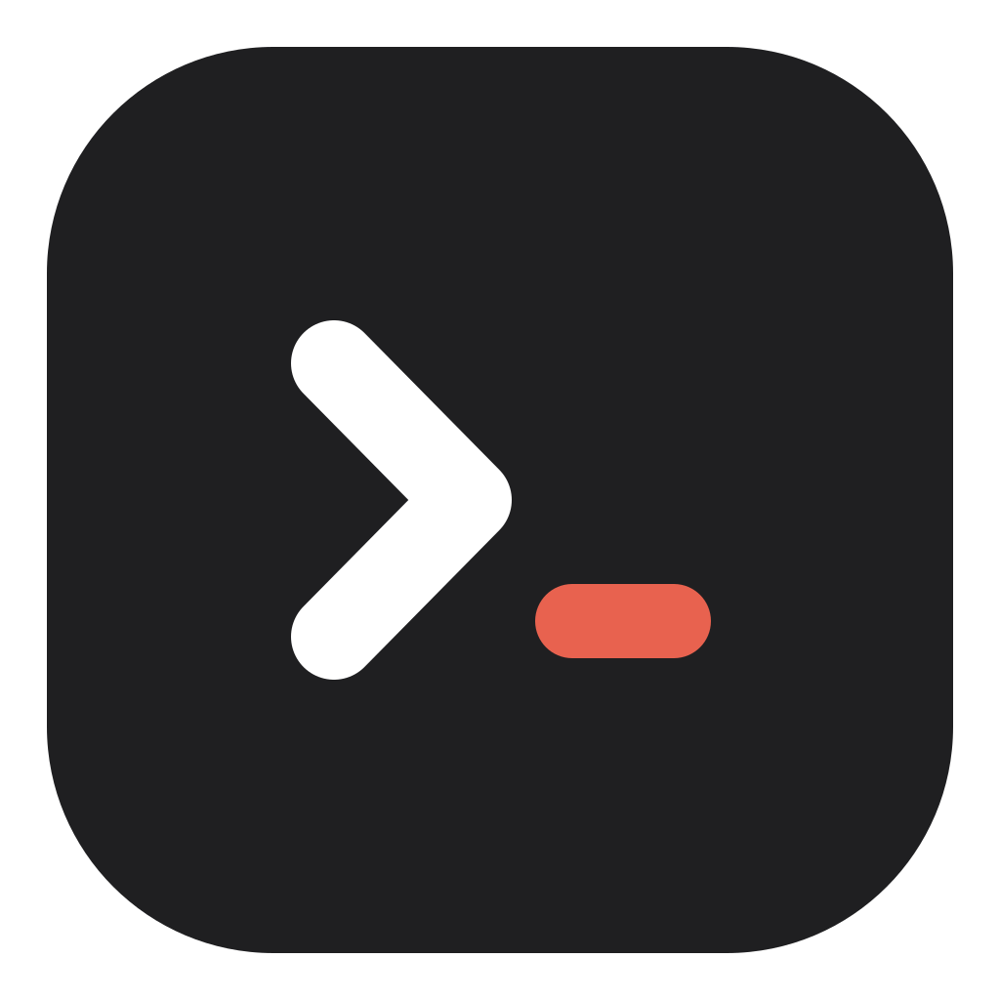
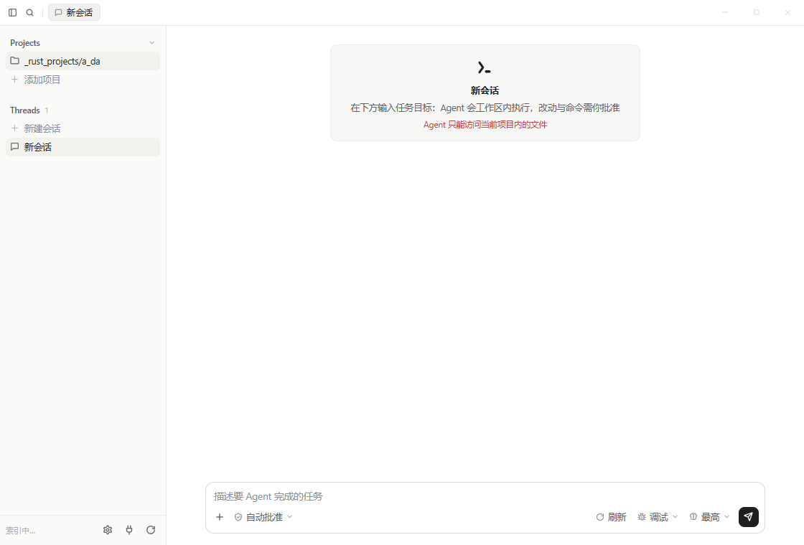
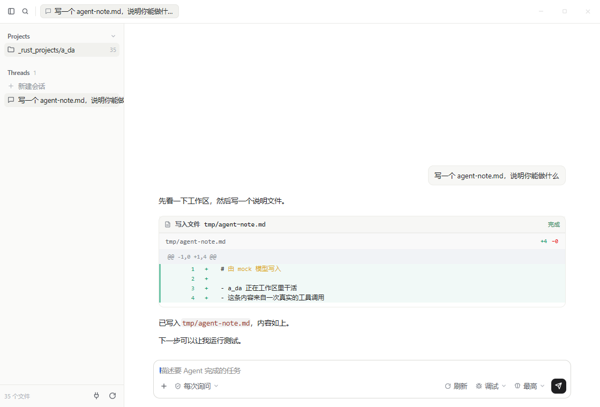
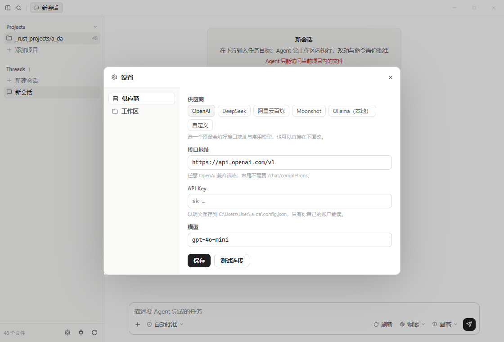
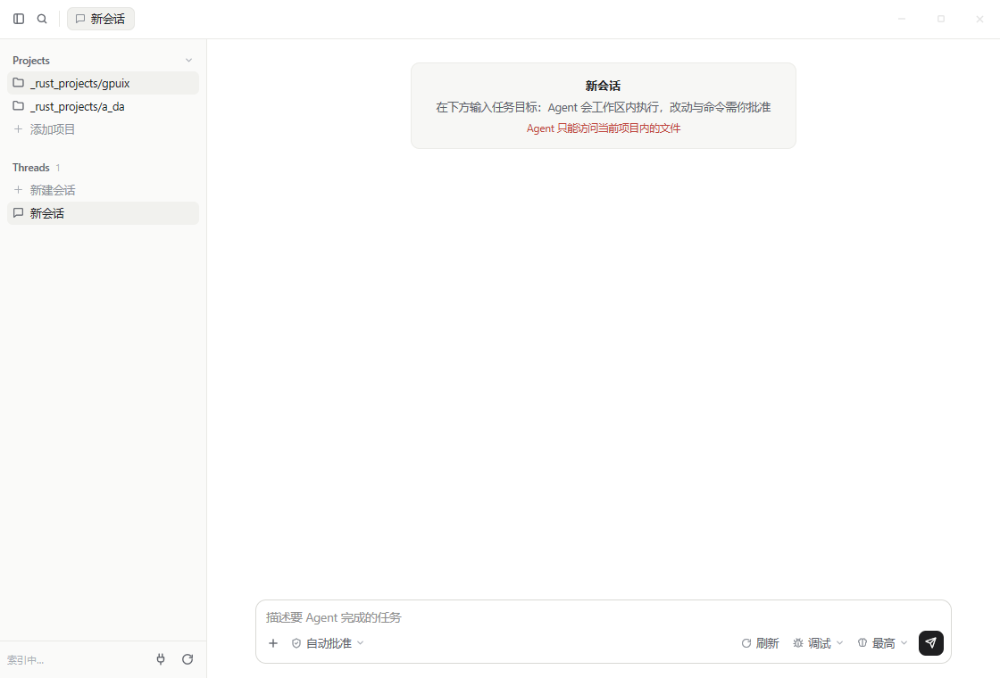

# a_da



一个本地 AI 编码 Agent 的桌面程序，用 [GPUIX](../gpuix) 写界面：React 组件直接由
GPUI 渲染到 GPU（Windows 上是 DirectX），没有 Electron、没有 WebView。

标志是一条 shell 提示符 `>_`：Agent 就是在工作区里跑命令的那个东西，方块的落点正好是
名字里那条下划线。源文件是 `assets/logo.svg`（1024 网格，暗色圆角块 + 白 chevron +
红色光标块）和 `assets/logo-mark.svg`（去掉底块的单色版，用 `style.color` 上色）。



一轮真实的回合：流式回复、需要批准的写入、以及原生 `<diff>` 渲染的改动卡片
（这张图来自 `bun scripts/smoke.ts`，模型是本地 mock）：



窗口里的每一像素都是 GPUIX 画的：侧边栏、会话列表、欢迎卡片、输入框和底部的三个
设置芯片。标题栏是一条 36px 的窄条：图标与标签页之间那片空白是拖拽区，整条都能拖动
窗口；右侧的最小化 / 最大化 / 关闭按钮在 Windows 上通过 `user32.dll` 真正作用于窗口。

## 设置弹窗

侧边栏底部的齿轮打开设置：标题栏与内容之间是一条 1px 的分隔线，内容是左右两栏——
左边切分节，右边是该节的表单。默认停在「供应商」，因为这是不填就没法工作的那项。



- **供应商**：预设（OpenAI / DeepSeek / 阿里云百炼 / Moonshot / Ollama / 自定义）
  会填好接口地址和常用模型；下面三个字段可以随便改
- **保存** 写进 `~/.a-da/config.json`，并保留文件里其它字段（手写的键不会被覆盖）
- **测试连接** 用当前的地址、Key、模型发一次最小请求，结果直接显示在按钮右边
- **工作区**：当前项目、索引统计、项目与会话数量、配置文件的落盘位置、工具清单
- 按 `Esc` 或点右上角关闭；弹层会同时吞掉点击和滚轮，后面的会话区不会被误操作

> 环境变量（`A_DA_API_KEY` / `A_DA_MODEL` / `A_DA_BASE_URL`，以及 `OPENAI_*`）优先于
> 配置文件。检测到它们生效时，弹窗会明确提示“运行时会用环境变量的值”。
> `A_DA_CONFIG` 可以换掉配置文件的路径（测试就靠它不碰你真实的配置）。

## 它做什么

在下面的输入框里用自然语言描述任务。Agent 会在**当前项目目录**内工作：

| 工具 | 作用 |
|---|---|
| `list_files` | 列目录（跳过 `node_modules`、`.git`、`dist` 等） |
| `read_file` | 读文本文件（最多 400 行） |
| `search_files` | 用正则搜索代码 |
| `write_file` | 新建或整体覆盖文件，返回 unified diff |
| `edit_file` | 精确替换一段文本，要求 `old_string` 唯一 |
| `run_command` | 在工作区内执行 shell 命令（120s 超时，输出截断） |

所有路径都会被解析回该会话所属项目的根目录，任何指到项目外的路径都会被拒绝——
包括 `run_command` 的 `cwd`。这是侧边栏红字那句承诺的实现位置：`src/agent/tools.ts`。

### 项目与会话

一个会话（Thread）从建立那一刻起就绑定一个项目目录，之后切换项目不会改变它：
正在等待批准的写入，即使你已经切到别的项目，落盘的位置仍然是它自己那个目录。

- 侧边栏 **Projects** 列出所有已打开的项目，点一下切换；“添加项目”接受一个目录路径
  （会先检查存在且是目录，失败时在行内报错，不会加进来一个永远报错的项目）
- **Threads** 只显示当前项目的会话；每个项目的会话列表互相独立



### 三个芯片

- **自动批准 / 每次询问 / 只读** —— 写入和执行何时需要你点“批准”。
  等待批准时，工具卡片里会出现批准 / 拒绝两个按钮，只有你点了才继续。
- **刷新** —— 重新扫描工作区。
- **调试** —— 打开右侧事件日志：模型端点、每次工具调用、每个错误。
- **最高 / 高 / 中 / 低** —— 传给接口的 `reasoning_effort`。

一轮还没跑完时继续输入，指令会排队（输入框会提示“继续输入以排队后续修改”），
同时芯片区会出现“停止”。

## 运行

```bash
bun install          # 安装 typescript / 类型
bun run link         # 把本地 ../gpuix 的三个包连进来（见下）
bun run icons        # 从 assets/logo.svg 生成 logo.png 与 logo.ico（改了 logo 才需要）
bun run dev          # 开发：bun --hot app.tsx，保存即重挂载
bun run build        # 产出 dist/a-da.exe（单文件，带 native addon 与图标）
```

先决条件：`../gpuix` 已经 `bun install` 且 `bun run build`（编译出
`packages/native/gpuix-native.*.node` 与 `packages/react/dist`）。

### 为什么要 `bun run link`

`@gpuix/react` 通过 `workspace:` 协议依赖 `@gpuix/native`，这个协议只在 gpuix 仓库
内可解析，所以这里不把 gpuix 的两个包写进 `dependencies`。另外**整个应用必须和
gpuix 共用同一份 React**：reconciler 把 hook dispatcher 装在它 import 的那份 React
上，装进来第二份 React 会让每个 `useState` 直接报错。`scripts/link.ts` 用目录
junction 建好这几条链接（Windows 下不需要管理员权限），并检查两端是否都已编译。

### 配置模型

任何 OpenAI 兼容的 `/chat/completions` 端点都可以。优先级：环境变量 →
`~/.a-da/config.json`。

```bash
A_DA_API_KEY=sk-…
A_DA_MODEL=gpt-4o-mini
A_DA_BASE_URL=https://api.openai.com/v1   # 可选，默认 OpenAI
A_DA_WORKSPACE=/path/to/project           # 可选，默认进程当前目录
```

也可以直接在设置弹窗里填写（写的就是这个文件，双击 exe 启动时同样生效）：

```json
{ "apiKey": "sk-…", "model": "gpt-4o-mini", "baseUrl": "https://api.openai.com/v1" }
```

没配置时程序不报错，进入**离线模式**：仍然真的跑一次 `list_files`，把工作区规模
和配置方法告诉你，方便先看界面。

## 代码结构

```
app.tsx                     入口：render(<AgentWindow />) 与窗口选项
src/AgentWindow.tsx         窗口骨架：标题栏 + 侧边栏 + 会话区 + 输入区 + 设置弹层
src/theme.ts                颜色、字号、行高、markdown 主题、路径缩写
src/icons.tsx               内联 SVG 图标（随二进制一起打包）
src/agent/store.ts          Agent 运行时：会话、循环、批准闸门、事件日志
src/agent/config.ts         供应商配置：环境变量 / 配置文件 / 预设 / 连通性测试
src/agent/llm.ts            OpenAI 兼容的流式客户端（SSE、工具调用分片累积）
src/agent/tools.ts          工作区沙箱与六个工具
src/agent/patch.ts          行级 LCS → unified diff（给 <diff> 渲染）
src/agent/types.ts          消息、条目、工具 schema
src/ui/SettingsDialog.tsx   设置弹窗：header + 横线 + 左右两栏
src/ui/*                    标题栏、侧边栏、会话区、输入区、事件日志、控件
src/platform/win32.ts       无边框窗口的拖动 / 最小化 / 最大化 / 关闭
assets/logo.svg             应用标志（含底块，给图标与文档用）
assets/logo-mark.svg        单色标志（用 style.color 上色，欢迎卡片里就它）
assets/logo.ico|png         icons 脚本生成的产物，build 会把它塞进 exe
scripts/*                   一套对着真实窗口 / 真实进程的检查，见「测试」
```

界面层没有状态管理库：`store` 是模块级单例，异步轮次直接改它，React 通过
`subscribe` 收到通知后重渲染，所以流式回复在到达过程中就是对的。

## 测试

```bash
bun test                        # 41 个用例：沙箱与 diff、项目隔离、设置弹窗、菜单浮层、logo 资产、窗口 GPU 渲染、mock 模型的完整回合
bun run screenshot out.png      # 启动真实窗口并截图（GPUIX_BACKGROUND=1，不抢焦点）
bun scripts/smoke.ts            # 真实窗口里跑完整回合：输入 → 批准 → 写入 → diff 卡片
bun scripts/projects-check.ts   # 真实窗口里加项目：坏路径报错，好路径切换并重新扫描
bun scripts/settings-check.ts   # 真实窗口里开设置：切分节、截图、Esc 关闭
bun scripts/menu-check.ts       # 截两张弹窗菜单，看圆角有没有露出深色背景
bun scripts/make-icon.tsx       # 由 assets/logo.svg 生成 png/ico，并校验四角是透明的
bun scripts/png-pixels.ts a.png # 解一个 PNG 像素出来（没有图像库时的放大镜）
bun scripts/window-controls.ts  # 对着真实 OS 窗口验证拖动 / 最大化 / 还原 / 最小化 / 关闭
bun scripts/drag-probe.ts       # 拖动出问题时用：把每次移动的坐标与应用到的位置打出来
bun scripts/binary-check.ts     # 启动 dist/a-da.exe，等待首帧并截图
```

界面测试用 `createTestRoot()`，不开窗口、不抢键盘，走的是和线上完全相同的
`GpuixView` / `build_element()` / 绘制路径；`scripts/` 里的几个脚本则是对着**真实窗口**
和**真实进程**的检查，两种都要跑。

## 已知限制

- 窗口按钮与拖动是 **Windows 专有**（`bun:ffi` 调 user32）。macOS 上按钮不绘制，
  交给系统红绿灯；GPUIX 目前没有跨平台的窗口控制 JS API
- 拖动是**应用自己算的**，不是系统的移动循环：`WM_NCLBUTTONDOWN` + `HTCAPTION`
  会被 GPUI 自己的窗口过程消费掉（`DefWindowProc` 根本收不到），`WM_SYSCOMMAND` /
  `SC_MOVE` 在这台机器上也进不了移动循环（用 `GetGUIThreadInfo` 实测：UI 线程始终不在
  `GUI_INMOVESIZE` 里）。所以改成：按下时记下光标相对窗口的抓取偏移，之后每次指针移动
  算出新位置（`src/platform/win32.ts`）
- 位置按**手势是怎么开始的**决定用哪个坐标：按下时物理左键确实按着（真人拖拽）就用
  光标的屏幕坐标——`SetWindowPos` 由窗口线程异步应用，用事件里的窗口坐标会对着一个
  还没移动过的窗口，正好只走一半距离；按下时没有物理按键（自动化合成事件、触摸/手写笔）
  就用事件坐标，因为此时真实光标与手势无关，让它优先会劫持整段拖拽
- 代价：没有 Aero Snap（只有系统循环能做）；最大化时不能拖动（先点还原）
- 拖动从固定的拖拽区开始（标签页也可以）。这块区域不能有可点子元素：同时监听
  down 与 move 会让 GPUIX 在这棵子树上装 pointer capture，祖先一旦捕获，
  最小化/最大化/关闭的点击就被吞掉了——这三个按钮曾经真的因此失效
- 项目与会话只存在于本次运行：退出后列表清空（还没有落盘的会话文件）
- 弹窗菜单是**两层盒子**：GPUIX 的 `<anchored>` 会在子元素后面强制刷一层不透明的
  `#1A1A1A`（防止延迟层透出页面），如果圆角卡片就是那一层，四个角会切开这层深色——
  暗色主题里看不出来，浅色主题下一眼就是"黑角"。所以浮层那层是**方角纯色**，
  圆角 / 描边 / 阴影都在内层卡片上（`src/ui/controls.tsx` 有说明，`controls.test.ts`
  钉住了这个不变量，`scripts/menu-check.ts` 用来肉眼复核）
- 没有语法树感知的编辑，`edit_file` 是精确字符串替换
- 命令超时后只杀 shell 本身，不保证杀掉整棵进程树
