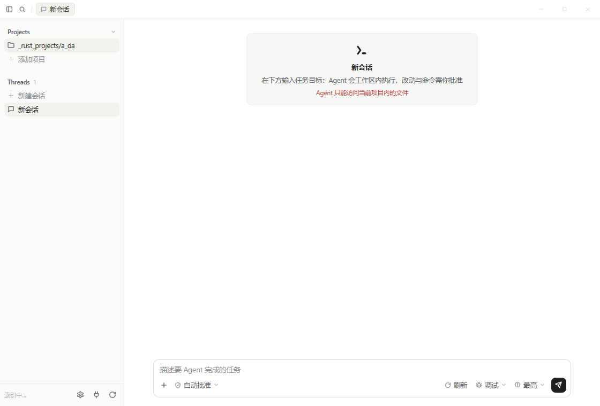
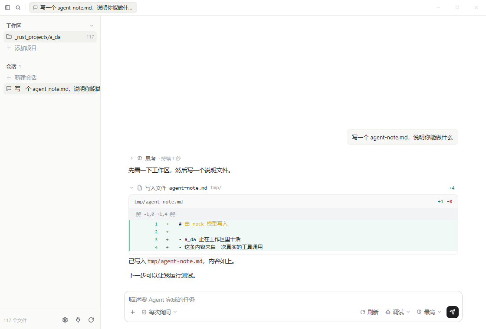
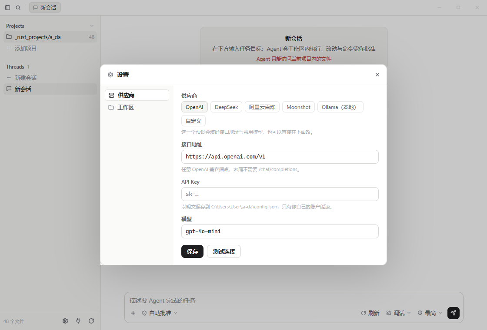
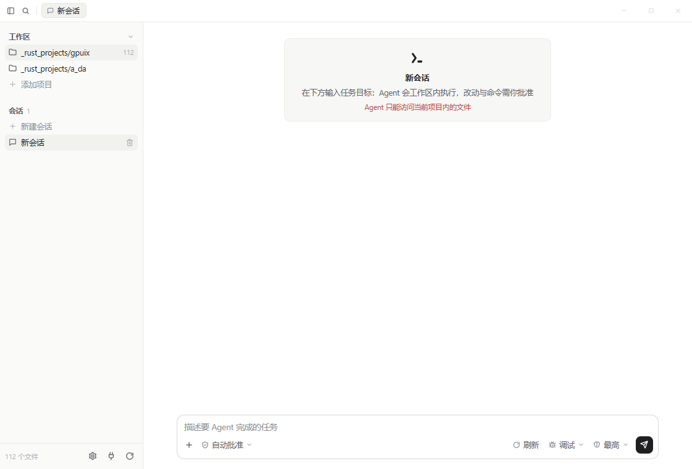

# a_da

> ### 状态（2026-10-08）：纯 Rust 微内核基座与产品线架构已全面落地（M1–M5 完成）
>
> 仓库采用现代化**纯 Rust 微内核**架构（`crates/agent-base`），实现多产品声明式装配（`products/ada-coding`、`products/ada-skeleton`）：
>
> - **微内核**：[`crates/agent-base/`](crates/agent-base)（零 IO、零产品名词、唯一循环驱动 `run_turn`）
> - **协议单源**：[`crates/agent-proto/`](crates/agent-proto) 与 [`spec/proto/`](spec/proto)（JSON-RPC 76 个方法、TypeScript 客户端类型单一真源生成）
> - **组合根与工具包**：[`crates/agent-runtime/`](crates/agent-runtime) 与 [`crates/agent-toolkit/`](crates/agent-toolkit)
> - **合规测试套件**：[`crates/agent-conformance/`](crates/agent-conformance)（8 个核心端口契约 + 8 条跨端口不变量，全自动化验证）
> - **产品交付**：[`products/ada-coding/`](products/ada-coding) 结合 Tauri 桌面宿主（[`src-tauri/`](src-tauri) + [`tauri-ui/`](tauri-ui)），极简骨架 [`products/ada-skeleton/`](products/ada-skeleton)
> - **出包与工作流**：`cargo xtask ship --product <id>` 一键打出独立可执行交付二进制（支持 Windows GUI 子系统补丁）
>
> 历史 TS 实现已整体冻结至 [`archive/ts-legacy/`](archive/ts-legacy)。
>
> - 架构设计与规划：[docs/agent-base-design.md](docs/agent-base-design.md)、[docs/agent-base-plan.md](docs/agent-base-plan.md)
> - 协作者规范与规矩：[AGENTS.md](AGENTS.md)


一个本地 AI 编码 Agent 的桌面程序，用 [GPUIX](../gpuix) 写界面：React 组件直接由
GPUI 渲染到 GPU（Windows 上是 DirectX），没有 Electron、没有 WebView。

标志是一条 shell 提示符 `>_`：Agent 就是在工作区里跑命令的那个东西，方块的落点正好是
名字里那条下划线。源文件是 `assets/logo.svg`（1024 网格，暗色圆角块 + 白 chevron +
红色光标块）和 `assets/logo-mark.svg`（去掉底块的单色版，用 `style.color` 上色）。



一轮真实的回合：流式回复、模型先想一段（可展开的「思考」行）、需要批准的写入，以及点开
之后由原生 `<diff>` 渲染的改动卡片（这张图来自 `bun scripts/smoke.ts`，模型是本地 mock）：



窗口里的每一像素都是 GPUIX 画的：侧边栏、会话列表、欢迎卡片、输入框和底部的三个
设置芯片。标题栏是一条 36px 的窄条：图标与标签页之间那片空白是拖拽区，整条都能拖动
窗口；右侧的最小化 / 最大化 / 关闭按钮在 Windows 上通过 `user32.dll` 真正作用于窗口。

## 设置弹窗

侧边栏底部的齿轮打开设置：标题栏与内容之间是一条 1px 的分隔线，内容是左右两栏——
左边切分节，右边是该节的表单。默认停在「供应商」，因为这是不填就没法工作的那项。



- **供应商**：预设（OpenAI / DeepSeek / 阿里云百炼 / Moonshot / Ollama / 自定义）
  会填好接口地址和常用模型；下面三个字段可以随便改
- **保存** 写进 `~/.a-da/config.json`，并保留文件里其它字段（手写的键不会被覆盖）
- **测试连接** 用当前的地址、Key、模型发一次最小请求，结果直接显示在按钮右边
- **工作区**：当前项目、索引统计、项目与会话数量、配置文件的落盘位置、工具清单
- 按 `Esc` 或点右上角关闭；弹层会同时吞掉点击和滚轮，后面的会话区不会被误操作

> 环境变量（`A_DA_API_KEY` / `A_DA_MODEL` / `A_DA_BASE_URL`，以及 `OPENAI_*`）优先于
> 配置文件。检测到它们生效时，弹窗会明确提示“运行时会用环境变量的值”。
> `A_DA_CONFIG` 可以换掉配置文件的路径（测试就靠它不碰你真实的配置）。

> 配置、会话流水、全局扩展、调试日志都在同一个数据目录 `~/.a-da` 下；
> `A_DA_HOME` 可以换掉这个目录。
> `A_DA_NO_DIALOG=1` 关掉原生目录选择弹窗（脚本与自动化用；界面会退回到手输路径）。
> 网络要走代理就设 `HTTPS_PROXY` / `HTTP_PROXY`：Bun 的 fetch 认这两个变量，模型请求和
> 扩展的网络请求都会跟着走。

## 它做什么

在下面的输入框里用自然语言描述任务。Agent 会在**当前项目目录**内工作：

| 工具 | 作用 |
|---|---|
| `list_files` | 列目录（跳过 `node_modules`、`.git`、`dist`、`build`、`coverage` 等） |
| `read_file` | 读文本文件，支持 `offset`/`limit` 按行段读（默认 400 行）；超 512KB、二进制、目录都拒绝 |
| `search_files` | 用正则搜索代码（最多 200 条命中）；支持 `literal` 纯文本、`case_sensitive`、`context` 上下文行与 `path` 子目录限定 |
| `find_symbol` | 按名字查函数/类/结构体定义的位置与签名（TS/JS、Python、Rust、Go、Java、C#；60s 内存索引） |
| `write_file` | 新建或整体覆盖文件，返回 unified diff |
| `edit_file` | 精确替换一段文本，要求 `old_string` 唯一；也可以一次给多组 `edits` |
| `run_command` | 在工作区内执行 shell 命令（默认 120s 超时，可延长到 600s，超时杀整棵进程树，输出截断） |
| `run_background` / `check_task` / `kill_task` | dev server、watcher 这类长命令：后台启动立即返回任务 id，轮询状态与输出，按需整树终止 |
| `todo` | 多步骤任务规划，会话区右上角的悬浮面板呈现进度 |

这份工具表不是写死的常量：每轮开始时向 `ToolRegistry` 要一次，所以扩展注册的工具也会
出现在模型的工具表里（见下面的「扩展」）。

所有路径都会被解析回该会话所属项目的根目录，任何指到项目外的路径都会被拒绝——
包括 `run_command` 的 `cwd`。这是侧边栏红字那句承诺的实现位置：
`src/agent/tools/workspace.ts`。字符串级检查之后还会 realpath 解析符号链接：工作区内
指向外面的 symlink（含 Windows junction）按**真实落点**拒绝，目录遍历对链接条目做
同样的把关。唯一有意留下的口子：`run_command` 是真 shell，逃逸沙箱的命令它管不了。

### 一轮对话是怎么跑的

模型侧的一切都在 `src/agent/core`。`runAgentLoop` 是一个异步生成器：一边流式接收
`ai/stream.ts` 的增量，一边把生命周期事件 yield 出去；`store.ts` 订阅这些事件并翻译成
界面卡片，它自己不跑循环、也不自己拼消息。

- **审批闸门**挂在 `beforeToolCall` 上。拒绝走的是 `block` 而不是「工具执行失败」：循环会
  把拒绝理由当成一次工具结果回给模型，模型知道是被拒了，不会以为调用成功了
- **一行一次调用**。会话区里每个工具调用默认只占一行：三角、图标、工具名、目标
  （文件名在前、目录是暗色小字）、改动量 `+N −M`、以及还没有结束的状态（等待批准 /
  执行中 / 失败 / 已拒绝）。点这一行才展开细节——`<diff>` 或工具输出；命令展开后是
  一份终端记录，先是 `$ 命令` 再是它的输出。跑完的行不再挂状态字，行不再动就是结束了。
  **失败和被拒的行也默认收起**，红色的状态字已经说明了出过事，点开才看原因
- 行距按「行高 + 3」排：一屏要能读下几十次调用。超出宽度的部分以**省略号**收尾——
  这需要在弹性行里给文字 `minWidth: 0`，否则弹性项撑着内容宽度不收缩，只会被硬裁
  （`scripts/rows-check.ts` 按像素盯住这三件事：行距、收起行下面不该有线、长参数不许顶到
  内容列边缘）
- **思考链单独一行**，默认收起，只显示「思考 · 持续 N 秒」，点开才是推理原文。它通常
  是整轮里最长的东西，不该把回答挤下去。这一行只在接口真的吐了 `reasoning_content` /
  `reasoning` 时出现
- 整轮的执行过程收纳在**一个折叠条**里（`N 个步骤 · 思考耗时 · +A −M · 已完成`），完成后
  默认收起。展开体有**高度上限**（窗口高度的一半，夹在 240–560 之间，随窗口走而不是写死
  像素）：超了就自己内部滚动——"超过界面"从结构上不发生，折叠条不会被一个长过程顶走
- 被上限截住时，块尾会出现一条**「还有内容被折叠（共 N 步）· 显示全部」**。这条提示是必需的，
  不是装饰：GPUix 对普通 `overflow: scroll` 容器只挂 ScrollHandle（滚轮能滚）、**不画持久
  滚动条**，光封顶会让内容"看不出来还有"（实测踩过：展开 139 步的过程，内容被截住但界面上
  没有任何"还有"的迹象）。点它就放开这一块的上限，读完整段
- 展开后**右下角常驻一个「收起执行过程」胶囊**：列表贴底或滚到中段时折叠条本来就可能
  在视口外，这个入口始终够得着（展开着几个就一起收，文案带 `×N`）。它**只在有展开块时
  渲染**，所以平时不占地方——这也是刻意不做"超过一屏才出现"这道门的原因：展开态到底有没有
  超过一屏，在本层测不到（GPUIX 没有布局测量回调，虚拟列表里整块只是一个列表项），
  用猜的阈值做门只会变成"看起来装上了、其实没生效"
- 工具**顺序执行**——审批一次只该问一件事，命令之间也不该互相抢工作目录。`runAgentLoop`
  本身也支持并行（每个工具各有一条驱动任务，事件按到达顺序转发）
- 工具输出**实时**上浮：`run_command` 的标准输出在命令还在跑的时候就到达卡片，
  而不是等结束才补发
- 会话历史就是 `thread.messages`（`core/types.ts` 的 `AgentMessage`），也就是真正发出去过的
  那一份，没有第二套消息形状需要转换
- 撞上单轮 24 步上限会被事件流告知（`agent_end` 的 `reason`），界面据此提示可以继续输入

### 扩展

打开一个项目时会自动加载两处 TypeScript 扩展（用 `jiti` 直接执行 `.ts`）：

- `<项目>/.ada/extensions/*.ts`
- `~/.a-da/extensions/*.ts`

**首选写法是声明式描述符**——一个纯数据对象，加载器直接读它：

```ts
export default {
  name: '我的插件',
  description: '做什么用的',
  tools: [ myTool ],            // 也可以省，只贡献 skills / prompts
  skills: [ { name, description, content } ],
}
```

需要运行时上下文（订阅事件、按工作区动态建工具）时才用函数形态，它在两种情况下都会被
调用：`export default (ctx) => { ctx.registerTool(...); ctx.onEvent(...) }`。`ctx` 提供
`registerTool` 注册工具、`onEvent` 订阅 Agent 生命周期事件、`trace` 往调试面板打点。
两种形态产出的插件对象完全一样，`id` 由加载器按「目录作用域 + 文件名」决定（写成
`workspace:我的插件.ts`），插件自己不必知道装在哪。

扩展还可以声明 `dependsOn: ['builtin:git-tools']`（依赖缺失或未启用会被跳过并在日志里
说明）、`engines: { a_da: '>=0.1.0' }`（不匹配只警告，仍加载）、以及 `configSchema`
（声明需要用户提供的配置项；缺 `required` 项时插件标记为「待配置」且不注册它的工具）。

注册进来的工具会和内置工具一起发给模型，也能被调用。同名工具的覆盖规则是**后注册者胜**，
但覆盖会被记成冲突并警告（插件工具顶掉内置工具是最容易被误当成「内置工具坏了」的一种）。

仓库里带了一个能跑的例子：**`.ada/extensions/web-search.ts`**（联网搜索）。它就是上面的
声明式形态，也刻意不 import 应用里的任何东西——扩展是要能被复制的独立文件。想让它对
每个项目都生效，把它拷到全局目录：

```bash
cp .ada/extensions/web-search.ts ~/.a-da/extensions/
```

它用 Bing 而不是 DuckDuckGo 抓结果，因为后者在部分网络里连不上（实测超时）、且不需要
key 的选择里 Bing 最稳。**网络要走代理时不用改代码**：Bun 的 fetch 认
`HTTPS_PROXY` / `HTTP_PROXY`，应用和扩展的请求都会跟着走，例如
`HTTPS_PROXY=http://127.0.0.1:7897 bun app.tsx`。

验证它有没有真的跑通：

```bash
bun scripts/extension-check.ts   # 加载 → 进工具表 → 真调一次 → 结果回给模型（需要联网）
```

> ⚠️ 项目里那份是随仓库克隆进来的第三方代码，**打开项目就会被执行**。因此「只读」模式下
> 扩展工具一律要审批：只读白名单是写死的一小批内置名字，名单之外的一律当成写操作。

插件的加载状态与诊断（缺依赖、缺配置、版本不匹配、工具名冲突）会写进调试面板的事件日志，
前缀 `[插件]`；`defaultExtensionLoader.getDiagnostics()` 也能按插件取到同一份数据。

#### 插件钩子（可干预的决策点）

除注册工具，插件还能注册**钩子**——返回值会改变控制流，所以和只读的 `onEvent` 分开：

```ts
export default function (context) {
  context.registerHooks({
    beforeTurn: async (ctx) => ({
      // 只能**收窄**：新工具名会被核心剔除（工具集是审批闸门的依据）
      tools: ctx.tools.filter((tool) => tool.name !== 'run_command'),
    }),
    afterTurn: async (ctx) => {
      // ctx.effectiveToolNames 是**实际下发**的工具名（回执）：据此校验自己的决策是否生效
      ctx.trace?.(`本轮实际工具：${ctx.effectiveToolNames.join('、')}`)
    },
  })
}
```

点位成对：`beforeAgentStart`/`afterAgentEnd`、`beforeTurn`/`afterTurn`、
`beforeToolCall`/`afterToolCall`、`beforeSubagentStart`/`afterSubagentEnd`、
`beforeApproval`/`afterApproval`、`beforeCompaction`/`afterCompaction`、
`beforeThreadCreate`/`afterThreadCreate`、`beforeThreadDelete`/`afterThreadDelete`、
`beforeLlmRequest`/`afterLlmResponse`、`beforeSkillLoad`/`afterSkillLoad`、
`beforeTodoUpdate`/`afterTodoUpdate`；另有四个刻意不成对的单向点位
（`onThreadSwitch`、`beforeSystemPrompt`、`beforePersist`、`afterCheckpoint`）。`after*` 即使 `before*` 被短路也会执行——不然被短路插件的
清理逻辑就没了。钩子抛错或超时都只当作"没有意见"并记进调试日志，**绝不打崩主循环**。

能力开关写在 `config.json` 的 `pluginCapabilities`，**默认全开**：

```jsonc
{
  "pluginCapabilities": {
    "allowSystemPromptReplace": true,  // beforeAgentStart 可整体替换系统提示词
    "allowTextRewrite": true,          // afterAgentEnd 可追加收尾文本
    "allowPlanModeHooks": true,        // 钩子在 plan 模式也生效
    "allowThirdPartyHooks": true,      // 第三方扩展可注册钩子
    "allowBuiltinShadow": true,        // 插件工具可覆盖同名内置工具
    "hookTimeoutMs": 500,              // 0 = 不限；超时放行并记 trace
    "overrides": { "workspace:web-search.ts": { "allowPlanModeHooks": false } }
  }
}
```

关掉某个开关时，用到它的插件会显示"受限"并在日志里说明原因——不允许静默失效。
`tools` 只能收窄这一条**不在此表中**，因为它不可配置（能扩张就等于绕过审批）。

`allowBuiltinShadow` 的具体行为值得单独说一句：**开着**（默认）时插件的同名工具生效、
该插件在卡片上标为"工具名冲突"；**关掉**后插件的同名工具**不注册**，内置工具保留，
插件同样标为冲突并写明"是哪个工具、因为哪个开关被挡下"。另外，插件工具**借走只读内置工具的
名字不会获得只读身份**——分类看的是"谁注册的"，否则一个叫 `read_file` 的插件工具就能绕过
plan 模式过滤与只读档位审批。

内置的 **decision** 插件是这套机制的第一个消费者：配 `pluginConfig.decision.toolRouting`
（空格或逗号分隔的工具名）可以按轮次收窄工具表，并在下一轮用它自己的回执核对是否真的生效。
留空表示不干预。

**ponytail** 是单向点位 `beforeSystemPrompt` 的第一个消费者：把 `defaultMode` 设成
lite / full / ultra 后，它每轮把**紧凑版**偷懒准则追加进系统提示词（追加永远生效，也不碰
用户自己的规范文本），并在调试日志里写明"按哪个档位注入的"。默认档位是 `off`。

审批与压缩这两个内部点位也开放给了插件：`beforeApproval` 可以放行（"白名单工具免问"）或拒绝
工具调用（拒绝理由会回给模型，而不是变成"执行失败"），`beforeCompaction` 可以追加必须保留的消息、
或整体替换压缩选择方案。两处的效力都刻意不对称：**`deny` 总是被采纳，`allow` 与"替换选择方案"
则受约束**——审批的放行在只读档位下会被忽略（那一档的语义就是"写操作必须经我确认"），压缩的替换
受 `allowCompactionReplace` 控制。理由是同一条：用户明确表态过的事，不让插件悄悄改掉。

插件卡上会显示加载状态（待配置 / 版本不兼容 / 加载失败 / 工具名冲突）、贡献计数（工具/技能/提示词
各几个）与具体诊断，包括可操作的建议——比如"缺哪一项配置、可以写进 `config.json` 的哪个键"。

插件管理里还有两页是给插件配置用的：**「能力开关」**逐项列出八个开关与"关掉后会发生什么"，
关掉后用到它的插件会在卡片上写出**受限原因**（哪一步会被忽略），不允许静默失效；
声明了 `configSchema` 的插件会在卡片上生成**配置表单**，四种类型都支持，其中密钥类
（`type: 'secret'`）**不回显**——只显示"已设置/未设置"，写入 `~/.a-da/secrets/<插件id>_<键名>`。

任务清单（`todo` 工具）也能干预：`beforeTodoUpdate` 可以补上模型漏掉的验收项、拆掉过碎的步骤，
或者直接拦下（例如"没有验收标准之前不许改计划"，理由会回给模型）；`afterTodoUpdate` 拿的是
**回执**——实际生效的清单、变了多少项，以及"完成了又被改回未完成"的那些项（计划被悄悄回滚，
是这类状态最容易出的问题），它还能往工具结果里追加一句旁注给模型看。

插件还能参与会话生命周期：建议新会话的标题、在会话里保存自己的数据（`Thread.pluginData`，
核心不解释、随会话持久化与删除）、在删除会话时拦下或要求先归档，以及订阅会话切换通知。

两处**刻意没有做**的能力，写在这里免得被当成 bug：`afterTurn` 不能改写本轮回答
（文本早已流式送达界面，没有替换通道）、`afterAgentEnd` 不能向已结束的会话追加旁注
（同样没有交付通道）。只声明不兑现的字段等于静默失效，所以契约里干脆没有它们。

### 内置辅助插件

除用户扩展外，系统自带一组官方插件包（`src/agent/tools/builtin-plugins/`），每个都按
「工具 + 技能 + 提示词」三位一体组织，可在插件管理里单独启停：

- **git-tools** —— `git_status` / `git_diff` / `git_log`：结构化的版本改动洞察
- **code-outline** —— `get_outline`：先拿符号大纲再定向读，省 token
- **project-inspector** —— `inspect_project`：探测技术栈、可用 scripts 与工具链
- **test-runner** —— `run_test_focused`：剥离通过日志，只抓失败断言与堆栈
- **batch-ops** —— `read_files` / `edit_files`：**一次调用覆盖多个文件**
- **decision** —— `decide` / `design_decision` / `check_gate`：**类型化判断**（见下）
- **ask-user** —— `ask_user`：任务中途向用户提问并等待回答（见下）
- **ponytail** —— 六个技能 + 六条同名斜杠命令：最省且能用的解法纪律（见下）

`batch-ops` 是专门治「步数」的：一次 `read_file` 只够读一个文件、一次 `edit_file` 只够改
一处，于是「看 8 个文件再改 3 个」要来回 11 轮模型请求，每轮都要重发整个上下文。把它们压成
一次调用后，一轮就能看全或落下一整批。写入侧没有绕开安全网：`edit_files` 动到的每个文件都
会分别建检查点，改动审阅面板也按文件拆开入账，可逐文件回滚。

### 决策插件（decision）

模型侧默认是「生成文本」范式。当任务需要的是**判断**而不是**生成**时，判断结论应当是可比、
可设阈值、可累计的，而不是埋在散文里等下一轮重新解析。`decision` 提供三种类型化问题：

| 类型 | 语义 | criteria |
|---|---|---|
| `choice` | 从若干选项选一个 | 选项 key → 说明的对象 |
| `noul` | 是/否概率（0–1） | 无（纯问题，不要给 criteria） |
| `score` | 按档位打分 | 档位数组，**最高档在前** |

三个工具：`decide`（直接问）、`design_decision`（给一段自由描述，自动设计出问题再判定）、
`check_gate`（按验收标准判定 git 改动 / 文件 / 文本是否通过）。均为**按需触发**，不产生每轮开销。

**三级引擎回退**（`auto`，可用 `decision.engine` 或 `A_DA_DECISION_ENGINE` 固定）：

1. `jev` —— Jev 兼容端点（`/systemOne`）。专用 System One 模型，**概率是校准的**。
   端点与密钥依次读 `A_DA_DECISION_BASE_URL` → `PI_JEV_BASE_URL` → `TYPESAFE_BASE_URL`、
   `A_DA_DECISION_API_KEY` → `TYPESAFE_API_KEY` → `~/.a-da/secrets/decision_api_key`
   （兼容 pi-jev 的变量名，已配好 Jev 的人不用重配）。
2. `local` —— 复用你自己配置的模型自评。**不采信它自报的概率**（聊天模型报的数普遍虚高），
   而是采样 N 次（默认 3）取**投票占比**：`noul` 用 yes 票占比、`choice` 用众数（平票取
   criteria 里靠前的 key）、`score` 用加权期望档位。
3. `heuristic` —— 确定性兜底，永远可用，但产出**刻意中性**的值（confidence 为 0）并明确
   标注「请勿据此决策」。

**概率的可靠性看 `calibrated` 字段**：`true` 才是可当概率用的（仅 Jev 引擎）；`false` 表示
未经校准（本地自评）或没有依据（启发式）。这是本插件的核心契约——**拿不到真实判断时宁可失败，
绝不编造一个看起来合理的概率**。

失败方向刻意分场景：`decide` 没有引擎时**直接失败**；`check_gate` 则默认 **fail-close**
（视为未通过），因为「门禁永远放行」比「要求人工复核」危险得多——需要放宽时显式传
`fail_open: true`，但结果会标注无判定依据。

配置写在 `config.json` 的 `decision` 块（`engine` / `baseUrl` / `apiKey` / `threshold` /
`samples` / `sampleTimeoutMs`）。默认阈值 0.65，门禁 0.70。

**开销**（按需触发，无每轮固定成本）：`decide` 与 `check_gate` 在 Jev 引擎下各 1 次请求，
在本地引擎下各 N 次（默认 3）；`design_decision` 为 1 次设计 + N 次评估；启发式 0 次。

### 子智能体与并发委派

`invoke_subagent` 把专项任务丢给隔离上下文里的专用子智能体（`researcher` /
`code_reviewer` / `tester` / `general_purpose`，也可自定义）。两种用法：

- **默认（同步）**：`invoke_subagent` 会一直等到子智能体产出完整报告才返回，适合「必须先
  拿到结论才能决定下一步」的任务
- **后台并发**：传 `async: true` 时立即返回，子智能体在自己的页签里继续跑，主对话不被阻塞。
  **有多个互不依赖的子任务时，就在同一轮里并发发起多个 `async` 调用**——它们会同时执行，
  之后用 `check_subagent` 取回结论

整批调用都显式声明 `parallel` 时，即使主循环的默认执行模式是 `sequential` 也会重叠执行；
只要批次里混进一个写工具，整批就退回串行（写工具之间不该抢工作目录，审批也不该一次弹一堆）。
后台子智能体不继承父轮次的中止信号，所以停止主对话或插队新指令不会把它连带杀掉。

### 挂起等待与唤醒（不再轮询）

主智能体派发完后台子智能体后，**不要**反复调 `check_subagent` 轮询：每一次轮询都是一整轮
模型请求，要把整个上下文重发一遍，又慢又贵，而且大概率仍只得到「正在运行中」。正确做法是
调 **`await_subagents`** —— 它不返回，主对话真的停在那儿等，直到子智能体把结论送回来；结论
随后以工具结果的形式回到模型手里，接着推理即可。

唤醒有两个来源：

- **子智能体主动唤醒**：子智能体调 `notify_parent`（`status: report`）把阶段性结论或需要上层
  拍板的问题送上去。`report` 语义是「主智能体该做下一步了」，立即结束等待，不等其余子任务；
  `done`/`error` 则等被等待的子任务**全部**结束，结论一次性交付
- **完成时自动唤醒**：子智能体正常收尾或异常失败时，若主智能体正在等待，系统自动带上成果摘要
  唤醒它。这是兜底——子智能体忘了调 `notify_parent` 也不会让主智能体挂到超时

默认超时 1 小时（`timeout_ms` 可覆盖），仅作防死锁兜底。几个边界都做了处理：子智能体比主智能体
先结束的结论会先缓冲、等挂起时立即交付（不丢）；主智能体不在等待时的唤醒只回报、不凭空启动
新轮次；没有任何可等待对象时立即返回、不干等。

等待期间主会话仍算「运行中」（那一轮还没结束），但侧边栏与标签栏会把它显示为**等待子智能体**，
和真正在跑的会话区分开。这个状态下发的消息照常排队，等唤醒、该轮结束后处理。

`notify_parent` 只在子智能体身份下存在（主智能体调它没有意义），因此也不在通用工具表里；它
绕过了子智能体 profile 的白名单，否则只读子智能体就唤醒不了父智能体，整个机制就断了。

### 检查点与改动审阅

批准即落盘，但随时有得退。`write_file` / `edit_file` / `edit_files` 获准执行**前**，目标
文件的内容会快照一份（检查点，追加进 `~/.a-da/checkpoints/<threadId>.jsonl`；单文件上限
5MB）。批量工具会为这一批涉及的**每个**文件分别建快照：

- 工具卡展开后有「撤销此次改动」：恢复该次调用前的内容（新文件则删除）
- 会话标签栏右侧出现「改动」角标芯片（有改动才出现），打开**改动审阅面板**：本会话所有
  被跟踪的改动按文件聚合，逐文件看 diff、恢复到 Agent 动手之前的样子，或「全部恢复原状」。
  批量编辑会按文件拆成多行分别入账
- 回滚只认**被跟踪**的改动：`run_command` 里发生的（git、构建脚本）不在快照范围内

### 用户钩子（hooks）

在 `~/.a-da/hooks.json`（全局）或 `<项目>/.ada/hooks.json` 里声明「某事件发生时跑这条
shell 命令」，Agent 在对应点位代为执行；命令从 stdin 收到 JSON 载荷（tool / args /
thread_id / workspace），并注入 `A_DA_HOOK_EVENT` / `A_DA_HOOK_TOOL` 环境变量：

```json
{ "hooks": [
  { "event": "before_tool", "tool": "edit_file", "command": "node check.js" },
  { "event": "after_tool",  "tool": "edit_file, write_file", "command": "prettier --write ." },
  { "event": "agent_end",   "command": "echo done" }
] }
```

- `before_tool`：工具获准执行后、真正执行前。**退出码非零 = 拦截这次调用**，stderr 成为
  回给模型的理由（守门用）
- `after_tool`：执行完（自动格式化用）；返回值不影响结果
- `agent_end`：一轮结束
- `tool` 省略或 `*` 匹配所有；逗号分隔精确匹配多个。坏条目跳过并在调试日志给警告，
  不会让整个配置作废

### 快捷键与命令面板

`Ctrl+K` 打开命令面板：输入过滤、上下键/回车导航，面板本身就是一份可执行的快捷键清单。
全局快捷键（窗口级监听，无需聚焦）：`Ctrl+T` 新建对话、`Ctrl+B` 侧边栏、`Ctrl+D`
调试日志、`Ctrl+R` 改动审阅、`Ctrl+W` 关闭标签、`Ctrl+,` 设置、`Ctrl+Shift+P` 插件管理、
`Esc` 关浮层。定义集中在 `src/ui/shortcuts.ts`。

### 项目说明（AGENTS.md）

打开项目时，工作区根目录的 `AGENTS.md`（没有则 `CLAUDE.md`）会自动注入系统提示词的
「项目说明」段，之后的每轮对话模型都看得见（超过 32k 字符截断）。输入 `/init` 让模型
调研项目并生成这份文件。

本仓库自己按**两层**组织这份文件，兼顾注入体积与细节留存：

- `AGENTS.md` 是 **≤60 行的导航版**——项目速览、常用命令、目录职责，外加一张 §索引
  （每条一句话警告），会被注入每轮对话；
- `docs/agent-conventions.md` 是**深度约定全文**（原 AGENTS.md 正文），改核心代码前按需查。

迁出时**原样保留了 `§1–§15` 的章节编号**，所以 `docs/` 与源码注释里既有的
「`AGENTS.md` §9」「`AGENTS.md` 第 1 条」这类引用无需改动，含义见根文件末尾的索引表。

### 工作区与会话

一个会话（Thread）从建立那一刻起就绑定一个工作区目录，之后切换工作区不会改变它：
正在等待批准的写入，即使你已经切到别的工作区，落盘的位置仍然是它自己那个目录。

- 侧边栏 **工作区** 列出所有已打开的项目，点一下切换；**添加项目** 会打开系统原生的
  目录选择弹窗（Windows 的 PowerShell + FolderBrowserDialog），选中即加入。弹窗开不出来
  时（非 Windows、`A_DA_NO_DIALOG=1` 的自动化场景）同一个位置会留一个输入框可以直接
  粘贴路径。加进来之前都会先检查存在且是目录，失败时在行内报错，不会加进来一个永远
  报错的项目
- **会话** 只显示当前工作区的会话；每个工作区的会话列表互相独立。每行最右边有个垃圾桶
  图标，**点两下才删**：第一下把图标变成红色的「确认删除」（鼠标移出这一行就复位），
  第二下真的删——会话记录是这一轮的唯一副本，删掉就没了（盘上那份 JSONL 也一起删）
- 删掉某个工作区的最后一个会话时，会补一个新的空会话，工作区不会因此从侧边栏消失；
  正在跑的那一轮不能被删（先停止）



### 三个芯片

- **自动批准 / 每次询问 / 只读** —— 写入和执行何时需要你点“批准”。
  等待批准时，工具卡片里会出现批准 / 拒绝两个按钮，只有你点了才继续。
- **刷新** —— 重新扫描工作区。
- **调试** —— 打开右侧事件日志：模型端点、每次工具调用、每个错误。
- **最高 / 高 / 中 / 低** —— 传给接口的 `reasoning_effort`。

一轮还没跑完时继续输入，指令会排队（输入框会提示“继续输入以排队后续修改”），
同时芯片区会出现“停止”。模型配置开了 Vision 时，输入框支持图片附件：点 `+` 从
文件选择器挑、把图片文件**拖进输入框**、或直接 **Ctrl+V 粘贴**剪贴板里的截图
（纯文本粘贴不受影响；GPUX 没有剪贴板 API，粘贴走 PowerShell 读 Windows 剪贴板兜底）。

### 智能体提问（ask_user）

`ask_user` 让智能体在任务中途停下来问一句：改哪个模块、要不要兼容旧接口、能不能接受
破坏性变更。给了选项就是选择题（点一下即可），不给就是自由问答。**待答的问题浮动在
输入框上方**——与排队消息同一位置，因为整轮正卡在那里等：若它随会话流被上翻一屏或
被虚拟列表回收，屏幕上就没有任何"在等我"的痕迹。作答之后浮动面板退场，卡片回到会话流
里当历史记录（"当时问了什么、答了什么"）。

两条边界：**子智能体不能直接提问**（并发派发时用户不知道在回答谁，它该经
`notify_parent` 把问题交给主智能体），也**不设超时**（用户没答就是没答，要停就按停止）。

### 偷懒工程学（ponytail）

技能集移植自 [ponytail](https://github.com/DietrichGebert/ponytail)（MIT），按本仓库的插件
契约改写成六个技能 + 六条同名斜杠命令。它**不提供任何工具**——和 `approval-guard` 一样是
纯纪律插件，全部内容都是给模型看的判断准则：

- `/ponytail [lite|full|ultra]` —— 进入偷懒模式，核心是一条阶梯：**这东西需要存在吗（YAGNI）
  → 本仓库有没有现成的 → 标准库 → 平台原生能力 → 已装依赖 → 一行 → 只有到这一步才写"能用的
  最少代码"**。档位只影响表达强度：lite 照做但点一句更省的做法，full 强制执行，ultra 先删后加
  并同时质疑需求剩下的部分。
- `/ponytail-review` —— 只看过度设计的评审，每条一行（`L42: yagni: 只有一个产品的工厂。内联掉。`），
  收尾给 `net: -<N> lines possible.`；正确性、安全、性能明确不在射程内，另走常规评审。
- `/ponytail-audit` —— 同一个视角扫全仓而不是一个 diff，按「能砍多少」排序。
- `/ponytail-debt` —— 把散落的 `ponytail: <上限>, <升级触发条件>` 注释收成债务台账；
  没写触发条件的标 `no-trigger`——真正会烂掉的就是那些。
- `/ponytail-gain` / `/ponytail-help` —— 收益记分板（上游基准中位数，不换算成"本仓库省了多少"：
  没写出来的那个版本从未存在，没有可减的基线）与速查卡。

想让它**每轮自动生效**而不必每次口头激活，把插件的「默认档位」设成 lite / full / ultra
（`config.json` 的 `pluginConfig.ponytail.defaultMode`，或环境变量
`A_DA_PLUGIN_PONYTAIL_DEFAULT_MODE`，后者优先）。默认档位是 **off**：内置插件是预装给所有人的，
默认值等于替所有人改系统提示词，所以刻意不默认开启。开启后注入的是**紧凑版**阶梯（完整规则
仍按需用 `Skill` 工具加载），且目前**只作用于主会话循环**——`beforeSystemPrompt` 还没接到
子智能体循环上，子智能体不会自动带上这条纪律。

## 运行

```bash
bun install          # 安装 typescript / 类型
bun run link         # 把本地 ../gpuix 的两个包连进来（见下）
bun run icons        # 从 assets/logo.svg 生成 logo.png 与 logo.ico（改了 logo 才需要）
bun run dev          # 开发：bun --hot app.tsx，保存即重挂载
bun run build        # 产出单一独立可执行文件 dist/a-da.exe（Windows）或 dist/a-da
bun run typecheck    # tsc --noEmit，和 bun test 是两个独立的门，两个都要过
```

先决条件：`../gpuix` 已经 `bun install` 且 `bun run build`（编译出
`packages/native/gpuix-native.*.node` 与 `packages/react/dist`）。

Windows 上 build 产出单一独立可执行文件 `dist/a-da.exe`（内嵌完整 native addon 与图标）。
构建脚本自动将 PE 头补丁修正为 GUI 子系统（`IMAGE_SUBSYSTEM_WINDOWS_GUI`），双击时原生零黑框
静默启动图形界面，不再需要任何外部启动器或辅助进程。

### 为什么要 `bun run link`

`@gpuix/react` 通过 `workspace:` 协议依赖 `@gpuix/native`，这个协议只在 gpuix 仓库
内可解析，所以这里不把 gpuix 的两个包写进 `dependencies`。另外**整个应用必须和
gpuix 共用同一份 React**：reconciler 把 hook dispatcher 装在它 import 的那份 React
上，装进来第二份 React 会让每个 `useState` 直接报错。`scripts/link.ts` 用目录
junction 建好这几条链接（Windows 下不需要管理员权限），并检查两端是否都已编译。

### 配置模型

任何 OpenAI 兼容的 `/chat/completions` 端点都可以。优先级：环境变量 →
`~/.a-da/config.json`。

```bash
A_DA_API_KEY=sk-…
A_DA_MODEL=gpt-4o-mini
A_DA_BASE_URL=https://api.openai.com/v1   # 可选，默认 OpenAI
A_DA_WORKSPACE=/path/to/project           # 可选，默认进程当前目录
A_DA_HOME=/path/to/data                   # 可选，默认 ~/.a-da
```

也可以直接在设置弹窗里填写（写的就是这个文件，双击 exe 启动时同样生效）：

```json
{ "apiKey": "sk-…", "model": "gpt-4o-mini", "baseUrl": "https://api.openai.com/v1" }
```

没配置时程序不报错，进入**离线模式**：仍然真的跑一次 `list_files`，把工作区规模
和配置方法告诉你，方便先看界面。

## 代码结构

```
app.tsx                     入口：render(<AgentWindow />)、窗口选项与平台引导
src/AgentWindow.tsx         窗口骨架：标题栏 + 侧边栏 + 会话区 + 输入区 + 设置弹层
src/theme.ts                颜色、字号、行高、markdown 主题、路径缩写
src/icons.tsx               内联 SVG 图标（随二进制一起打包）
src/agent/home.ts           应用数据目录（~/.a-da，A_DA_HOME 可换）
src/agent/store.ts          界面状态层：把事件翻译成卡片、审批闸门、会话落盘
src/agent/config.ts         供应商配置：环境变量 / 配置文件 / 预设 / 连通性测试
src/agent/core/agent-loop.ts  事件循环：多轮流式、工具调度、生命周期事件与钩子
src/agent/core/agent.ts     Agent 控制器：订阅事件、维护状态、转向/后续消息队列
src/agent/core/types.ts     消息与事件模型（AgentMessage / AgentEvent / AgentTool）
src/agent/ai/stream.ts      OpenAI 兼容的流式客户端（SSE、思考链、工具调用分片累积、请求重试退避）
src/agent/checkpoint.ts     写操作检查点与回滚（~/.a-da/checkpoints）
src/agent/hooks.ts          用户钩子：hooks.json 的 before_tool / after_tool / agent_end
src/agent/tools/proc.ts       进程树清理（taskkill /T 或 POSIX 进组信号）
src/agent/tools/registry.ts   工具注册中心（内置 + 扩展）与只读白名单
src/agent/tools/workspace.ts  路径沙箱（字符串检查 + realpath 符号链接把关）与遍历跳过清单
src/agent/tools/loader.ts     用 jiti 加载工作区 / 全局的 .ts 扩展工具
src/agent/tools/builtins/*    内置工具（读/写/搜/命令/后台任务/符号索引/子代理/todo 等）
src/agent/tools.ts          对外适配层：runTool / describeTool / scanWorkspace
src/agent/session/manager.ts  会话 JSONL 落盘（~/.a-da/sessions）
src/agent/patch.ts          行级 LCS → unified diff（给 <diff> 渲染）
src/agent/types.ts          界面条目形状（Item / Thread / DebugEntry）
src/ui/SettingsDialog.tsx   设置弹窗：header + 横线 + 左右两栏
src/ui/*                    标题栏、侧边栏、会话区、输入区、事件日志、控件
src/platform/win32.ts       无边框窗口的拖动 / 最小化 / 最大化 / 关闭
src/platform/dialog.ts      原生目录选择弹窗（PowerShell + FolderBrowserDialog）
assets/logo.svg             应用标志（含底块，给图标与文档用）
assets/logo-mark.svg        单色标志（用 style.color 上色，欢迎卡片里就它）
assets/logo.ico|png         icons 脚本生成的产物，build 会把它塞进 exe
.ada/extensions/web-search.ts  扩展的例子（联网搜索），见「扩展」
scripts/*                   一套对着真实窗口 / 真实进程的检查，见「测试」
```

界面层没有状态管理库：`store` 是模块级单例，异步轮次直接改它，React 通过
`subscribe` 收到通知后重渲染，所以流式回复在到达过程中就是对的。

## 测试

```bash
bun test                        # 全量用例（数量以运行输出为准）：沙箱与 diff、读取守卫、工具权限、事件循环与工具事件的实时性、扩展加载与插件契约（溯源/冲突/依赖/必填配置）、思考行、会话落盘与删除、目录选择、工作区隔离、设置弹窗、菜单浮层、logo 资产、窗口 GPU 渲染、mock 模型的完整回合
bun run screenshot out.png      # 启动真实窗口并截图（GPUIX_BACKGROUND=1，不抢焦点）
bun scripts/smoke.ts            # 真实窗口里跑完整回合：输入 → 批准 → 写入 → diff 卡片
bun scripts/projects-check.ts   # 真实窗口里加项目：坏路径报错，好路径切换并重新扫描
bun scripts/session-delete-check.ts # 真实窗口里点一下会话行右边的垃圾桶：确认删除 + 真的少一行
bun scripts/rows-check.ts       # 一列工具行：行距、收起行下面有没有多余的线、长参数有没有用省略号（按像素量）
bun scripts/extension-check.ts  # 扩展插件：加载 → 进工具表 → 真调一次 → 结果回给模型（需要联网）
bun scripts/settings-check.ts   # 真实窗口里开设置：切分节、截图、Esc 关闭
bun scripts/menu-check.ts       # 截两张弹窗菜单，看圆角有没有露出深色背景
bun scripts/make-icon.tsx       # 由 assets/logo.svg 生成 png/ico，并校验四角是透明的
bun scripts/png-pixels.ts a.png # 解一个 PNG 像素出来（没有图像库时的放大镜）
bun scripts/window-controls.ts  # 对着真实 OS 窗口验证拖动 / 最大化 / 还原 / 最小化 / 关闭
bun scripts/drag-probe.ts       # 拖动出问题时用：把每次移动的坐标与应用到的位置打出来
bun scripts/window-probe.ts <pid> # 一个进程到底开了哪些窗口（类名 + 尺寸），找多出来的窗口时用
bun scripts/binary-check.ts     # 启动 dist/a-da-core.exe，等待首帧并截图
```

测试通过 `bunfig.toml` 的 preload（`scripts/test-preload.ts`）把 `A_DA_HOME` 指到临时
目录、并设上 `A_DA_NO_DIALOG=1`：前者保证用例不往你真实的 `~/.a-da` 里写会话，后者
保证它们不会真的弹出一个模态目录选择框把自动化挂在那里。

界面测试用 `createTestRoot()`，不开窗口、不抢键盘，走的是和线上完全相同的
`GpuixView` / `build_element()` / 绘制路径；`scripts/` 里的几个脚本则是对着**真实窗口**
和**真实进程**的检查，两种都要跑。

一个要注意的地方：`bun test` 的这些文件共用同一个 `store` 单例，文件之间怎么交错执行
由运行器决定。所以一个用例不能断言「另一个文件留下的状态」——要断言就断言自己这一段
代码能决定的文字（设置弹窗的用例原先断言会话标题，就因此在两次运行之间翻过面）。

另一个坑在 `scripts/` 那边，写脚本时容易踩：会话区是**虚拟列表**，自动化报出来的元素
边界是按 `estimatedItemHeight` 估算的，文字定位器给出的点可能偏几十像素（实测报 625、
实际画在 561），所以要点里面的东西只能自己算坐标；而且**不先移动就发的合成点击在真实
窗口里落不到处理器上**——真人用鼠标本来就是先移过去再按下，脚本里补一次 `mouseMove`
就行。两点都在 `scripts/smoke.ts` 里有注释。

## 已知限制

- 窗口按钮与拖动是 **Windows 专有**（`bun:ffi` 调 user32）。macOS 上按钮不绘制，
  交给系统红绿灯；GPUIX 目前没有跨平台的窗口控制 JS API
- 拖动是**应用自己算的**，不是系统的移动循环：`WM_NCLBUTTONDOWN` + `HTCAPTION`
  会被 GPUI 自己的窗口过程消费掉（`DefWindowProc` 根本收不到），`WM_SYSCOMMAND` /
  `SC_MOVE` 在这台机器上也进不了移动循环（用 `GetGUIThreadInfo` 实测：UI 线程始终不在
  `GUI_INMOVESIZE` 里）。所以改成：按下时记下光标相对窗口的抓取偏移，之后每次指针移动
  算出新位置（`src/platform/win32.ts`）
- 位置按**手势是怎么开始的**决定用哪个坐标：按下时物理左键确实按着（真人拖拽）就用
  光标的屏幕坐标——`SetWindowPos` 由窗口线程异步应用，用事件里的窗口坐标会对着一个
  还没移动过的窗口，正好只走一半距离；按下时没有物理按键（自动化合成事件、触摸/手写笔）
  就用事件坐标，因为此时真实光标与手势无关，让它优先会劫持整段拖拽
- 代价：没有 Aero Snap（只有系统循环能做）；最大化时不能拖动（先点还原）
- 拖动从固定的拖拽区开始（标签页也可以）。这块区域不能有可点子元素：同时监听
  down 与 move 会让 GPUIX 在这棵子树上装 pointer capture，祖先一旦捕获，
  最小化/最大化/关闭的点击就被吞掉了——这三个按钮曾经真的因此失效
- 项目与会话跨启动保留：会话写进 `~/.a-da/sessions/*.jsonl`（一行一条的追加流水），
  启动时全量恢复（消息、工具卡、压缩点、被拒状态都还原）
- **目录选择弹窗是 Windows 专有**，而且用的是 PowerShell 5.1 + `FolderBrowserDialog`
  （旧式树状选择器，不是 Vista 之后那个新对话框；后者要走 COM 的 `IFileOpenDialog`，
  在 FFI 里代价太大）。它靠一个临时进程开窗，所以从点击到弹窗出现大约 1.4 秒——这段
  时间侧边栏的行会显示「正在打开目录选择…」。弹窗以主窗口为 owner，所以不会跑到应用
  后面。非 Windows 上没有这个弹窗，直接退回到手输路径。要小心的一个坑：应用自己是
  GUI 子系统、没有控制台，而 `powershell.exe` 是控制台程序，**不带上 `windowsHide`
  （`CREATE_NO_WINDOW`）就会多出一个黑框**陪着弹窗一起出现——`dialog.test.ts` 钉住了
  这个选项
- 弹窗菜单是**两层盒子**：GPUIX 的 `<anchored>` 会在子元素后面强制刷一层不透明的
  `#1A1A1A`（防止延迟层透出页面），如果圆角卡片就是那一层，四个角会切开这层深色——
  暗色主题里看不出来，浅色主题下一眼就是"黑角"。所以浮层那层是**方角纯色**，
  圆角 / 描边 / 阴影都在内层卡片上（`src/ui/controls.tsx` 有说明，`controls.test.ts`
  钉住了这个不变量，`scripts/menu-check.ts` 用来肉眼复核）
- 没有语法树感知的编辑，`edit_file` 是精确字符串替换
- ~~命令超时后只杀 shell 本身~~：已改为整树清理（Windows `taskkill /T /F`，
  POSIX 进组信号，见 `src/agent/tools/proc.ts`）

上面这些是**实现层面**的限制。**功能层面**的缺口（还没做的功能、以及刻意不做的）单独维护在
[`docs/unfinished-features.md`](./docs/unfinished-features.md)：每一条都写了现状证据、影响与最小
实现路径。目前排在最前面的是 `@` 提及——输入框的占位文本在承诺它，但功能还没实现。
