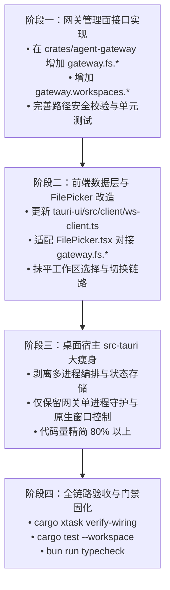

# 基于网关的工作区选择与极限瘦客户端架构设计

> 状态：**设计草案（v1.0）**  
> 目标：**彻底废弃桌面端原生文件/文件夹选择弹窗，将工作区与文件目录浏览能力完全收拢至网关（`ada-gateway`），桌面端彻底退化为极限瘦客户端（Extreme Thin Client），实现桌面与 Web 浏览器 100% 同构。**

---

## 0. 一页结论

1. **废弃 Native Dialog**：系统不保留任何操作系统原生文件/文件夹选择弹窗（如 Tauri Dialog、Win32/Cocoa/GTK 原生选择器）。所有目录树与文件选择统一通过前端内置的 Web 原生模态框 [`FilePicker.tsx`](file:///E:/codes/rust_projects/a_da/tauri-ui/src/components/FilePicker.tsx) 实现。
2. **网关作为文件系统与工作区门户**：工作区根目录选择、目录树遍历、历史工作区记录统一由网关管理面（`gateway.fs.*` 与 `gateway.workspaces.*`）提供。无工作区、冷启动、多实例切换及远程访问场景下，客户端均直面网关获取统一视图。
3. **桌面端蜕化为极限瘦壳**：桌面宿主（[`src-tauri`](file:///E:/codes/rust_projects/a_da/src-tauri)）彻底移除业务逻辑、文件操作以及复杂的多子进程管理，仅保留最基础的原生窗口外壳（Frame、无边框缩放、拖拽）和 WebView 宿主，以及针对本地单机部署的网关守护自启能力。
4. **全平台 100% 同构体验**：无论运行于 Tauri 桌面壳、普通 Chrome/Safari 浏览器、平板设备还是远程云端开发环境，UI 交互、工作区管理和文件浏览行为逐像素一致，没有任何平台特化分支。

```
┌────────────────────────────────────────────────────────────────────────┐
│                        前端 UI（React 100% 同构）                        │
│   • 会话与消息渲染                                                     │
│   • 统一 Web 原生 FilePicker 模态框（选择工作区 / 引用文件）           │
│   • 统一 JSON-RPC 客户端（ws-client）                                  │
└───────────────────────────────────┬────────────────────────────────────┘
                                    │ WebSocket (JSON-RPC)
                                    ▼
┌────────────────────────────────────────────────────────────────────────┐
│                       ada-gateway 网关（平台面）                        │
│   • 管理面：gateway.fs.* (roots, list, mkdir)                          │
│   • 管理面：gateway.workspaces.* (recent, remove, switch)              │
│   • 实例注册与路由：supervisor + registry (ensure_agent / attach)       │
│   • 鉴权与安全沙箱：路径遍历防护 + Scoped Token                         │
└───────────────────┬────────────────────────────────┬───────────────────┘
                    │ 内部转发                       │ 内部转发
                    ▼                                ▼
       ┌────────────────────────┐       ┌────────────────────────┐
       │   ada-coding 实例      │       │      ada-pm 实例       │
       │ (工作区 A 代码沙箱与引擎) │       │ (项目管理分派引擎)      │
       └────────────────────────┘       └────────────────────────┘
```

---

## 1. 架构演进与动机分析

### 1.1 为什么彻底剔除桌面原生弹窗（Native Dialog）

历史上桌面端应用倾向于调用操作系统原生文件对话框，但在现代 AI 智能体开发环境中暴露出严重的架构缺陷：

| 维度 | 原生文件对话框（Native Dialog） | 网关驱动的 Web-Native FilePicker |
|---|---|---|
| **远程 / Headless 场景** | **彻底失效**：网关运行于远程服务器/Docker，本地弹出的只有客户端本机的目录，无法选取服务器目录 | **天然支持**：浏览并选择的是网关宿主机真实文件系统 |
| **跨端同构（Web 访问）** | **不可用**：Web 浏览器直连网关时不存在 Tauri 原生插件，功能断裂 | **100% 同构**：浏览器与桌面端复用同一套交互组件 |
| **权限与安全受控** | 操作系统弹窗不可控，无法施加基于 Token 作用域的路径白名单与沙箱拦截 | 网关统一把关，可严格限制可访问目录集（`--allowed-roots`） |
| **UI 沉浸感与主题** | 风格生硬、阻断主线程、与 Dark 模式及整体 UI 视觉严重割裂 | 深浅主题无缝切换、内联搜索、键盘快捷导航一体化 |

因此，**将原生弹窗彻底剔除，全量转为由网关数据源驱动的 Web FilePicker 是实现云原生与跨端同构的必然要求。**

### 1.2 为什么由网关（Gateway）提供工作区与文件选择，而非 Agent 实例

在系统设计中，曾有 `fs.roots` / `fs.list` 放在 `agent-rpc`（Agent 实例）的实现。然而：
1. **冷启动悖论**：用户初次打开应用或尚未建立工作区时，对应工作区的 Agent 实例**尚未拉起**；若依赖 Agent 提供文件目录服务，就会出现“为了选择工作区，必须先有一个工作区实例”的死锁。
2. **工作区切换与多项目管理**：新增工作区、切换工作区属于平台级行为，跨越了单个 Agent 实例的生命周期边界。
3. **职责划分（INV-8 单一事实源）**：
   - **Agent 实例**：仅负责**特定工作区内部**的上下文感知、沙箱文件读写（`fs.read_base64` / 工具调用）；
   - **网关**：统一负责**全局宿主机**的磁盘根节点探测、工作区候选目录遍历、历史工作区记录维护与实例调度拉起。

### 1.3 桌面端蜕变：极限瘦客户端（Extreme Thin Client）

桌面端（[`src-tauri`](file:///E:/codes/rust_projects/a_da/src-tauri)）原先承载了较多职能：检查并启动多个子进程（`ada-coding`、`ada-pm`、`ada-gateway`）、读取本地配置文件、维护进程存活列表等。

重构后的定位是**极限瘦客户端**：
- **除原生窗口生命周期外，不编写任何业务与存储逻辑**；
- 桌面客户端与普通 Chrome 浏览器打开本地 Web 页面在能力上完全对等；
- 仅提供一个极轻量的“本地单机伴侣”（Local Companion）：当检测到未指定远程网关且本地未运行网关时，桌面壳静默拉起 `ada-gateway` 并注入其端口给 WebView。

---

## 2. 角色契约与架构拓扑

### 2.1 整体拓扑流程

```mermaid
sequenceDiagram
    autonumber
    actor User as 用户
    participant UI as 前端 Web UI (Tauri / Browser)
    participant GW as ada-gateway 网关
    participant AG as ada-coding / ada-pm 实例

    User->>UI: 打开应用 (冷启动)
    UI->>GW: 建立 WebSocket 连接 (gateway.info / gateway.status)
    
    rect rgb(30, 41, 59)
    Note over User,GW: 工作区与文件选择阶段 (全部由网关服务提供)
    User->>UI: 点击 "添加工作区" / "切换项目"
    UI->>GW: 调用 gateway.fs.roots
    GW-->>UI: 返回驱动器与常用目录 (C:\, D:\, Home, Desktop)
    User->>UI: 点击展开某个目录
    UI->>GW: 调用 gateway.fs.listDirectory(path, directoriesOnly=true)
    GW-->>UI: 返回子目录清单 (过滤系统级受限目录)
    User->>UI: 选定目录 "E:/projects/my-app"
    end

    rect rgb(15, 23, 42)
    Note over UI,AG: 实例调度与透传接入阶段
    UI->>GW: 调用 gateway.attach(workspace="E:/projects/my-app")
    GW->>AG: 按需拉起或复用该工作区的 Agent 实例
    GW-->>UI: 绑定成功，后续会话级协议由网关透明透传至 Agent
    end

    UI->>AG: 正常发起会话对话与代码生成
```



### 2.2 角色契约矩阵

| 模块 | 所属组件 | 职责范围 | 绝对禁止事项 |
|---|---|---|---|
| **桌面瘦宿主** | `src-tauri` | • 无边框窗口控制（最小化/最大化/关闭/拖拽）<br>• WebView 容器载入<br>• 本地守护伴侣（单机时静默起网关） | ❌ 禁止调用 OS 文件对话框<br>❌ 禁止直接读写会话/工作区文件<br>❌ 禁止直接管理 PM/Coding 多进程 |
| **网关平台** | `ada-gateway` | • 提供 `gateway.fs.*` 目录遍历与磁盘探测<br>• 提供 `gateway.workspaces.*` 历史记录管理<br>• 路径沙箱安全判定（防 `../` 穿透）<br>• Agent 实例生命周期管理（Supervisor）与透传（Relay） | ❌ 严禁内嵌多轮 Agent 执行循环（INV-1）<br>❌ 严禁缓存会话消息或工具状态（INV-8） |
| **Agent 实例** | `ada-coding` / `ada-pm` | • 工作区沙箱内的多轮执行（`run_turn`）<br>• 编写代码、执行终端命令、检查点管理<br>• 工作区内文件 Base64 预览（`fs.read_base64`） | ❌ 禁止暴露全局磁盘根目录选择接口<br>❌ 禁止自行跨工作区穿透读盘 |
| **Web 前端** | `tauri-ui` | • 沉浸式内置 `FilePicker` 交互渲染<br>• 全局会话状态机管理<br>• 主题、命令面板、工作区树展示 | ❌ 禁止使用任何 `@tauri-apps/plugin-dialog` 原生接口 |

---

## 3. 网关工作区与文件系统协议规范（RPC Specification）

网关在原有管理面方法（`gateway.info`, `gateway.attach`, `gateway.delegate` 等）基础上，正式扩充 `gateway.fs.*` 与 `gateway.workspaces.*` 命名空间。

所有方法均遵循 JSON-RPC 2.0 规范，通过统一的网关 WebSocket 链路传输。

### 3.1 磁盘根节点查询：`gateway.fs.roots`

获取当前宿主机可用的物理磁盘、挂载点以及常用快捷目录。

- **请求**：
```json
{
  "jsonrpc": "2.0",
  "id": "req-1",
  "method": "gateway.fs.roots",
  "params": {}
}
```

- **响应**：
```json
{
  "jsonrpc": "2.0",
  "id": "req-1",
  "result": {
    "roots": [
      { "id": "home", "name": "用户主目录", "path": "C:\\Users\\User", "kind": "home" },
      { "id": "desktop", "name": "桌面", "path": "C:\\Users\\User\\Desktop", "kind": "folder" },
      { "id": "drive-c", "name": "本地磁盘 (C:)", "path": "C:\\", "kind": "drive" },
      { "id": "drive-e", "name": "工作盘 (E:)", "path": "E:\\", "kind": "drive" }
    ]
  }
}
```

### 3.2 目录与文件列表浏览：`gateway.fs.listDirectory`

浏览指定路径下的子项。支持仅浏览目录（选择工作区场景）或浏览全量文件（选择引用附件场景）。

- **请求**：
```json
{
  "jsonrpc": "2.0",
  "id": "req-2",
  "method": "gateway.fs.listDirectory",
  "params": {
    "path": "E:\\codes\\rust_projects",
    "directoriesOnly": true,
    "showHidden": false,
    "limit": 500
  }
}
```

- **响应**：
```json
{
  "jsonrpc": "2.0",
  "id": "req-2",
  "result": {
    "path": "E:/codes/rust_projects",
    "parent": "E:/codes",
    "isRoot": false,
    "dirs": [
      { "name": "a_da", "path": "E:/codes/rust_projects/a_da", "isDir": true, "modifiedAt": 1728551200000 },
      { "name": "other-repo", "path": "E:/codes/rust_projects/other-repo", "isDir": true, "modifiedAt": 1728442000000 }
    ],
    "files": [],
    "total": 2,
    "truncated": false
  }
}
```

### 3.3 新建文件夹：`gateway.fs.makeDirectory`

在选定目录下创建新的子目录（用于用户在新建项目时直接在模态框内建立新目录）。

- **请求**：
```json
{
  "jsonrpc": "2.0",
  "id": "req-3",
  "method": "gateway.fs.makeDirectory",
  "params": {
    "parentPath": "E:\\codes\\rust_projects",
    "folderName": "my-new-app"
  }
}
```

- **响应**：
```json
{
  "jsonrpc": "2.0",
  "id": "req-3",
  "result": {
    "path": "E:/codes/rust_projects/my-new-app",
    "created": true
  }
}
```

### 3.4 历史工作区查询与管理：`gateway.workspaces.list` / `gateway.workspaces.remove`

网关持久化维护用户常用与最近访问的工作区清单（位于网关数据目录 `~/.a-da/workspaces.json`）。

- **请求 (`gateway.workspaces.list`)**：
```json
{
  "jsonrpc": "2.0",
  "id": "req-4",
  "method": "gateway.workspaces.list",
  "params": {}
}
```

- **响应**：
```json
{
  "jsonrpc": "2.0",
  "id": "req-4",
  "result": {
    "workspaces": [
      {
        "workspace": "E:/codes/rust_projects/a_da",
        "name": "a_da",
        "lastAccessedAt": 1728551200000,
        "isOnline": true,
        "activeProduct": "ada-coding"
      }
    ],
    "activeWorkspace": "E:/codes/rust_projects/a_da"
  }
}
```

- **请求 (`gateway.workspaces.remove`)**：
```json
{
  "jsonrpc": "2.0",
  "id": "req-5",
  "method": "gateway.workspaces.remove",
  "params": {
    "workspace": "E:/codes/rust_projects/other-repo",
    "killInstance": true
  }
}
```

---

## 4. 安全防护与沙箱控制模型（Security & Sandboxing）

将文件系统目录浏览开放给网关 RPC 后，必须严格遵守最小权限与失败安全原则：

```
                ┌────────────────────────────────┐
                │ 客户端接入请求 (路径 path)      │
                └───────────────┬────────────────┘
                                │
                                ▼
            ┌────────────────────────────────────────┐
            │ 1. 规范化路径 (Canonicalization)       │  剔除 ../ ./ 冗余斜杠
            └───────────────────┬────────────────────┘
                                │
                                ▼
            ┌────────────────────────────────────────┐
            │ 2. 网关鉴权态判断 (Auth Check)         │
            └───────────────┬───────────────┬────────┘
                            │               │
       (本地回环 127.0.0.1 模式)       (远程 0.0.0.0 暴露模式)
                            │               │
                            ▼               ▼
                 ┌─────────────────┐  ┌───────────────────────────────┐
                 │ 系统常规目录访问 │  │ 必须强制 Scoped Token 校验     │
                 │ 仅阻断系统保留区 │  │ 路径必须属于 --allowed-roots │
                 └─────────────────┘  └───────────────────────────────┘
```

1. **路径规范化（Anti-Path Traversal）**：
   - 网关层收到任何路径字符串必须首先通过 `dunce::canonicalize` 或规范化算法展开符号链接；
   - 彻底拒绝相对路径穿透攻击（禁止包含逃逸父级的 `..` 序列）。
2. **远程与局域网网络隔离**：
   - 当网关以非回环模式启动（`--host 0.0.0.0` 或指定外网 IP）时，强制启用鉴权拦截：未认证或匿名连接**绝对禁止**调用 `gateway.fs.*`；
   - 远程模式可配置 `--allowed-roots <path_list>`（例如仅限 `/workspace` 或 `D:/projects`），任何超出该白名单前缀的 `listDirectory` 请求一律返回 `PermissionDenied` 错误码。
3. **系统保留与敏感路径过滤**：
   - 默认禁止遍历操作系统极敏感目录（如 Windows 下的 `C:\Windows\System32`、Linux 下的 `/etc/shadow`、`/proc`、`/sys` 等）；
   - 在目录检索响应中默认隐藏 `.git`, `node_modules`, `target` 等庞大构建产物内部文件遍历（提升传输性能与安全性）。

---

## 5. 前端沉浸式 FilePicker 改造与体验同构

### 5.1 数据源平滑切换

目前前端的 [`FilePicker.tsx`](file:///E:/codes/rust_projects/a_da/tauri-ui/src/components/FilePicker.tsx) 组件已经具备完善的 UI 交互（驱动器切换、搜索、新建文件夹、面包屑导航、文件类型过滤等），但原本调用的底层方法是直连的 `fs.roots` / `fs.list`。

**前端改造要点**：
1. **客户端方法映射升级**（在 [`tauri-ui/src/client/ws-client.ts`](file:///E:/codes/rust_projects/a_da/tauri-ui/src/client/ws-client.ts) 中）：
   ```typescript
   // 统一使用网关方法
   public fetchRoots(): Promise<FsRoot[]> {
     return this.request<FsRoot[]>('gateway.fs.roots', {})
   }

   public listDirectory(path: string, directoriesOnly = false, showHidden = false): Promise<FsListing> {
     return this.request<FsListing>('gateway.fs.listDirectory', {
       path,
       directoriesOnly,
       showHidden,
     })
   }

   public makeDirectory(parentPath: string, folderName: string): Promise<{ path: string }> {
     return this.request<{ path: string }>('gateway.fs.makeDirectory', {
       parentPath,
       folderName,
     })
   }
   ```
2. **多场景通用复用**：
   - **选择工作区场景**：传入 `mode="directory"`，仅展示文件夹，点击确认后触发 `gateway.attach` 并切换前端活跃工作区；
   - **对话引用文件场景**：传入 `mode="files"`，展示文件与图标，支持多选并获取选中的文件绝对路径。

### 5.2 键盘导航与沉浸式体验规范

- **双击**：进入下级目录；
- **回车键**：在路径输入框直接跳转或选定；
- **Escape**：关闭模态框；
- **新建文件夹**：内联行式输入，就地创建并自动聚焦刷新，零弹窗阻断。

---

## 6. 桌面宿主（Tauri）瘦身改造方案

### 6.1 精简前后的 `src-tauri` 职责对比

| 模块 / 逻辑 | 精简前（现状） | 精简后（极限瘦客户端） | 改造手段 |
|---|---|---|---|
| **原生文件夹弹窗** | 未引入但架构未收敛 | **彻底不包含**任何 Native Dialog 依赖 | 彻底收拢至网关与前端 |
| **子进程多实例编排** | 在 `lib.rs` 内显式同时拉起 `ada-gateway`, `ada-coding`, `ada-pm` 多个进程，手写就绪信号匹配 | **完全下放给网关**：网关内置的 Supervisor 会按需动态管理 Coding/PM 进程 | 移除 Tauri 内的多进程调度代码 |
| **Tauri Command** | `get_core_info`, `get_process_report`, `kill_process`, `get/set_desktop_config` 等业务管理命令 | 仅保留最简 `get_gateway_endpoint` 与窗口缩放原生辅助命令 | 业务命令全部走网关 JSON-RPC |
| **代码量** | `lib.rs` 962 行 | 预计精简至 **~120 行** 极简外壳 | 极致纯粹 |

### 6.2 极简桌面宿主模型

瘦身后的 `src-tauri/src/lib.rs` 只做三件事：
1. **配置读取与端点确定**：
   - 检查环境变量 `A_DA_GATEWAY_URL` 或本地配置；
   - 若未配置且处于本地单机运行，拉起本地 `ada-gateway --port 0`，捕获就绪端口；
2. **窗口状态保持**：无边框窗口移动与大小缩放；
3. **退潮自毁（Watchdog）**：将桌面端 PID 传递给网关，窗口关闭时通知网关退出或依赖 PID 看门狗自然回收。

```rust
// 瘦身后的 Tauri 入口概念代码（仅约 100 行）
pub fn run() {
    tauri::Builder::default()
        .setup(|app| {
            // 1. 若本地无网关运行，拉起单个 ada-gateway 守护进程
            let endpoint = ensure_local_gateway_if_needed()?;
            // 2. 将网关 WebSocket 端点注入给前端页面
            app.manage(GatewayEndpoint(endpoint));
            Ok(())
        })
        // 仅保留原生窗口操作命令
        .invoke_handler(tauri::generate_handler![
            get_gateway_endpoint,
            minimize_window,
            maximize_window,
            close_window
        ])
        .run(tauri::generate_context!())
        .expect("运行 Tauri 桌面客户端失败");
}
```

---

## 7. 分阶段实施计划与验证门禁（Roadmap & Verification Gates）

### 7.1 分阶段实施路线



- **阶段一：网关接口补齐（`agent-gateway`）**
  - 在 [`crates/agent-gateway/src/relay.rs`](file:///E:/codes/rust_projects/a_da/crates/agent-gateway/src/relay.rs) 增加 `gateway.fs.roots`、`gateway.fs.listDirectory`、`gateway.fs.makeDirectory` 的处理臂；
  - 增加历史工作区管理存储 `crates/agent-gateway/src/workspaces.rs`；
  - 编写网关文件系统单元测试（测试路径遍历防护、隐藏文件过滤等）。
- **阶段二：前端无感切换（`tauri-ui`）**
  - 在 [`tauri-ui/src/client/ws-client.ts`](file:///E:/codes/rust_projects/a_da/tauri-ui/src/client/ws-client.ts) 中将目录请求改为 `gateway.fs.*`；
  - 验证空工作区启动下直接打开 `FilePicker` 选取新目录全流程；
  - 确认浏览器端与桌面端体验 100% 同构无差别。
- **阶段三：桌面端代码瘦身（`src-tauri`）**
  - 重构 [`src-tauri/src/lib.rs`](file:///E:/codes/rust_projects/a_da/src-tauri/src/lib.rs)，删除冗余的进程监控与重复的命令处理器；
  - 保留干净的窗口基础控制器。
- **阶段四：门禁集成**
  - 跑通 `bun run typecheck` 与 `cargo test --workspace -- --test-threads=1`；
  - 确保主干代码不出现任何对 OS 原生 Dialog 插件的引用。

### 7.2 质量与验证门禁

| 门禁项 | 验证命令 | 验收标准 |
|---|---|---|
| **门一：类型检查** | `bun run typecheck` | 前端 TypeScript 类型定义与调用零报错 |
| **门二：后端测试** | `cargo test --workspace -- --test-threads=1` | 网关文件遍历与路径沙箱单元测试 100% 通过 |
| **门三：架构接线** | `cargo xtask verify-wiring` | 架构依赖检查通过，网关不依赖内核内部状态（守住 INV-1 / INV-8） |
| **门四：归档隔离** | `bun run verify:archive` | 无主干代码引用已归档实现 |

---

## 8. 总结与后续建议

本方案将**文件系统与工作区选择的控制权完全转移给网关**，不仅彻底消除了桌面端与 Web 端割裂的原生弹窗历史遗留问题，也使 `a_da` 的桌面宿主蜕变为真正轻量、安全的现代化容器。后续可在该设计文档评审通过后，按第 7 节路线图分步落地实施。
