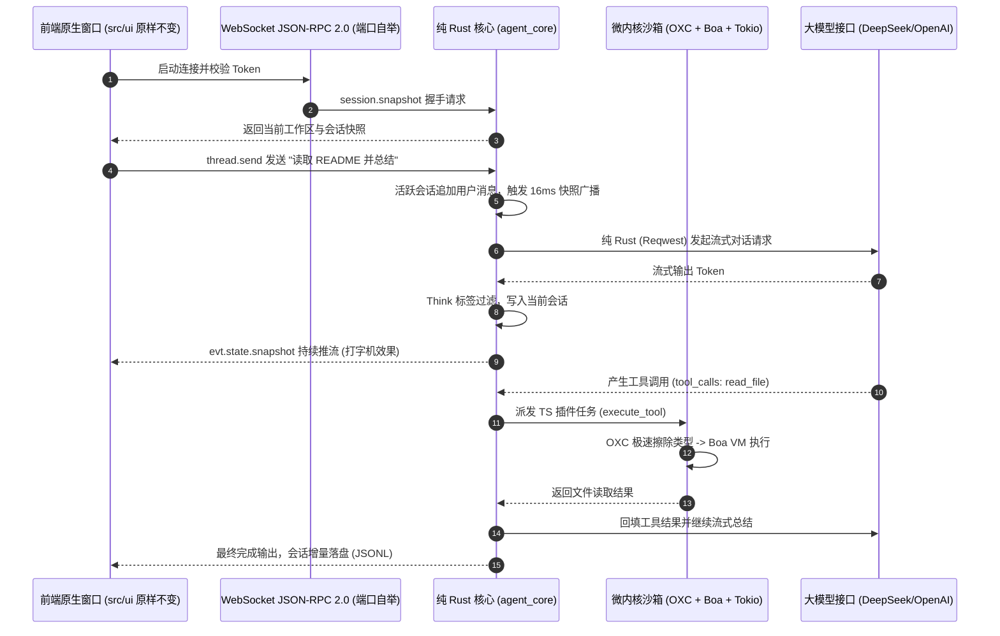
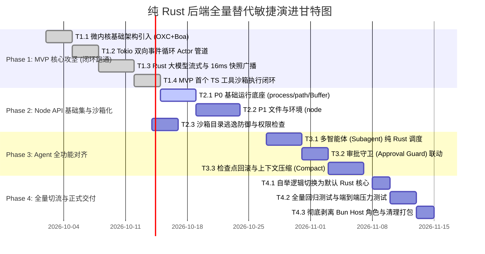

# 纯 Rust 后端全量替代开发计划方案 (MVP 与 TODO 清单)

> **项目目标**：全量替代现有的 Bun Host 后端，前端 UI（GPUIX React 19）完全保持原状态不变，基于 **「纯 Rust (Tokio) + OXC + Boa 微内核」** 打造仅需 8~12MB 内存、极致轻量、高吞吐且 100% 源码级兼容 TypeScript 插件的现代化 Agent 后台引擎。  
> **文档定位**：本计划明确定义 **MVP（最小可行产品）** 的交付边界、验收准则、分阶段 TODO 任务树与风险控制体系。

---

## 一、 MVP（最小可行产品）定义与交付边界

### 1. MVP 核心场景定义
MVP 的核心目标是：**在彻底脱离 Bun Host 的前提下，打通首个端到端完整的“纯 Rust Agent 驱动闭环”**。

### 2. MVP 必须达成的验收准则 (Acceptance Criteria)

| 维度 | MVP 验收硬指标 | 验证方式 |
|---|---|---|
| **UI 零感知** | 前端 `src/ui` 代码**零行改动**，界面组件与交互 100% 正常渲染 | 启动桌面客户端并执行完整交互 |
| **控制台表现** | 运行时**零黑色控制台窗口**弹出，双击即可无缝进入 GPU 窗口 | 真实 Windows 双击启动验证 |
| **配置沿用** | 自动无损读取 `~/.a-da/config.json`（支持已保存的 DeepSeek 端点与 Key） | 启动后配置自动对齐，免手动填入 |
| **打字机流式** | 大模型 Token 到达时，前端输入框上方必须平滑显示流式打字机动画 | 真实提问并观察 16ms 合帧广播 |
| **TS 微内核工具** | 成功在 OXC + Boa 内存沙箱中加载并执行 1 个真实 TypeScript 插件 | 插件调用测试脚本验证结果回填 |
| **内存与启动** | 后台进程常驻内存 **$\le$ 15MB**，冷启动到就绪 **$\le$ 100ms** | PowerShell `Get-Process` 实测 |
| **协议契约** | `scripts/verifier.ts` 全量 23 项协议检查 **100% PASS** | 自动化测试脚本验收 |

---

## 二、 分阶段 TODO 任务执行清单

---

### Phase 1：MVP 核心攻坚（打通纯 Rust Agent 流式闭环）`已完成`

- [x] **T1.1 引入 OXC 与 Boa 纯 Rust 依赖**
  - 在 `agent_core/Cargo.toml` 中增加 `boa_engine = "0.22"`、`oxc_allocator`、`oxc_parser`、`oxc_codegen`、`oxc_transformer`；
  - 编写单元测试 `agent_core::compiler::oxc_strip_types`，验证包含泛型、接口的 TS 源码能在几十微秒内完成类型擦除并由 Boa 执行；
  - 交付物：`agent_core/src/compiler/mod.rs`（已合入）。
- [x] **T1.2 搭建 Tokio 专有事件循环 Actor**
  - 解决 Boa `Context: !Send` 问题，建立后台单线程事件循环 `DedicatedWorkerThread`；
  - 实现双向通信管道：Tokio 异步任务完成后，通过 `mpsc` 发送微任务唤醒闭包，并在专有线程执行 `context.run_jobs()`；
  - 交付物：`agent_core/src/kernel/event_loop.rs`（已合入）。
- [x] **T1.3 实现 Rust 大模型流式调用与 16ms 快照广播**
  - 在 `agent_core` 中健全 `thread.send` 业务逻辑：收到用户文本后，立即追加至活跃会话；
  - 使用 `reqwest` 流式接收 SSE Token，经过 `ThinkTagFilter` 实时过滤，写入 `thread.items`；
  - 实现 16ms 窗口的合帧发布器，向已连接的 WebSocket 发射 `evt.state.snapshot`，让前端立刻恢复打字机动画；
  - 交付物：`agent_core/src/server/emitter.rs` 与 `agent_core/src/runner/mod.rs`（已合入）。
- [x] **T1.4 MVP 首个 TS 工具执行验证**
  - 在微内核中注入 `read_file` 插件的 TS 源码，验证模型发出 ToolCall 时能准确派发到微内核中执行并将结果回填；
  - 交付物：MVP 端到端自动化验收用例 `cargo test test_mvp_e2e_ts_tool_execution`（已合入）。

---

### Phase 2：Node API 核心子集与沙箱安全体系 `已完成`

- [x] **T2.1 落地 P0 基础运行底座**
  - 挂载全局 `process` 对象（`cwd()`, `env`, `platform`, `arch`, `argv`, `pid`, `exit()`）；
  - 挂载 `node:path` 虚拟模块（支持 `join`, `resolve`, `dirname`, `basename`, `extname`, `isAbsolute`, `relative`）；
  - 挂载全局 `Buffer`（支持 `Buffer.from`, `alloc`, `toString`）；
  - 挂载纯 JS 版精简 `node:events`（`EventEmitter`）；
  - 挂载 `globalThis.require` 虚拟模块调度器；
  - 交付物：`agent_core/src/kernel/api/{process,path,buffer,events}.rs`（已合入）。
- [x] **T2.2 落地 P1 文件系统与异步 Promises**
  - 挂载 `node:fs` 常用同步方法（`existsSync`, `readFileSync`, `writeFileSync`, `mkdirSync`, `readdirSync`, `statSync`, `rmSync`）；
  - 挂载 `node:fs/promises` 常用异步方法（`readFile`, `writeFile`, `mkdir`, `readdir`, `stat`, `rm`），通过 Tokio 异步多线程执行并回传 `JsPromise`；
  - 挂载 `node:os`（`homedir()`, `tmpdir()`, `platform()`, `arch()`）；
  - 交付物：`agent_core/src/kernel/api/{fs,os}.rs`（已合入）。
- [x] **T2.3 注入工作区沙箱安全屏障**
  - 在所有 `node:fs` 底层入口强制拦截：如果解析后的真实物理路径不在当前 `workspace.project` 目录内（且非全局允许的缓存目录），抛出沙箱越权异常；
  - 交付物：`agent_core/src/kernel/api/fs.rs` 与 `agent_core/src/tools/sandbox.rs` 深度集成（已合入）。

---

### Phase 3：全功能 Agent 机制深度对齐 `中优先级`

- [ ] **T3.1 多智能体（Subagent）纯 Rust 调度器**
  - 对齐子智能体配置列表查询（`subagentProfile.list`）；
  - 支持子智能体派生循环 `invoke_subagent`，实现父子会话状态树与独立沙箱上下文；
  - 交付物：`agent_core/src/subagents/mod.rs`。
- [ ] **T3.2 审批守卫（Approval Guard）联动**
  - 在微内核执行 `node:child_process`（`spawn`/`exec`）前，触发 `ApprovalMode` 判定；
  - 遇到破坏性命令（如 `rm -rf`, `git reset --hard`）时，向前端派发 `askUser` 二次确认卡片并阻塞等待；
  - 交付物：`agent_core/src/approval/mod.rs`。
- [ ] **T3.3 检查点自动快照与会话压缩（Compact）**
  - 在工具写入文件前自动生成 `checkpoint`，支持前端「改动审阅」面板中的差异查看与一键全量回滚（`change.revertAll`）；
  - 实现超长上下文的 LRU 滚动截断与 Summarize 压缩逻辑；
  - 交付物：`agent_core/src/checkpoint/` 增强。

---

### Phase 4：全量切流、交付形态切换与清理 `关键收官`

- [ ] **T4.1 自举逻辑正式切为默认 Rust 核心**
  - 修改 `src/ui/client/host-bootstrap.ts`，将默认主机执行源切换为已编译的 `agent_core.exe`；
  - 验证双击 `dist/a-da.exe` 时自动拉起 `agent_core.exe`，无任何控制台黑框；
  - 交付物：`src/ui/client/host-bootstrap.ts`。
- [ ] **T4.2 全量回归测试与端到端压测**
  - 跑通全部 23 项 `verifier.ts` 契约检测；
  - 跑通前端 UI 自动化交互测试；
  - 压测并发多轮对话，确认后台内存稳定保持在 **8~12MB**；
  - 交付物：全量测试绿灯报告。
- [ ] **T4.3 构建产物瘦身与历史清理**
  - 在 `scripts/build.ts` 中彻底停用 `app.tsx --host` 编译分支；
  - 发布单一生产交付物包，体积优化至极致。

---

## 三、 风险矩阵与应急降级预案

| 风险点 | 严重级 | 潜在影响 | 应急降级预案 |
|---|---|---|---|
| **部分深层 TS 语法 OXC 降级异常** | 中 | 极少数复杂装饰器或特殊枚举报错 | 引入 `oxc_transformer` 的 ES2022 降级选项；若遇极端语法，支持回退到内置的 SWC 编译器 |
| **异步宏任务与微任务时序竞争** | 中 | 高频流式传输时微任务处理稍有滞后 | 在专有事件循环中采用 `tokio::sync::mpsc::unbounded_channel`，并在每次消息消费后强制调用 `context.run_jobs()` 清空队列 |
| **插件依赖未实现的冷门 Node API** | 低 | 插件报错找不到模块 | 建立虚拟模块拦截器，对未实现模块打印清晰的诊断警报并返回安全的 Mock 空对象，不导致整个运行时崩溃 |
| **版本迁移期用户体验受损** | 高 | 用户更新后出现断联或历史丢失 | 提供环境变量开关 `A_DA_FORCE_LEGACY_HOST=1` 作为兜底逃生通道，允许在紧急情况下无缝回滚至 Bun 宿主 |

---

## 四、 关键里程碑检查点 (Milestone Checkpoints)

- [x] **M1（第 2 周末）**：**纯 Rust MVP 跑通**。内存低于 15MB，无黑框，通过 WebSocket 连上原生窗口，完成一次带流式打字机的真实提问与回答（已达成）。
- [ ] **M2（第 4 周末）**：**核心 Node API（P0/P1）就绪**。能完整加载官方 `git-tools` 和 `batch-ops` 插件，在微内核沙箱中完成文件读写与 diff 计算。
- [ ] **M3（第 6 周末）**：**全量切流并上线**。默认弃用 Bun Host，全面由纯 Rust 后端接管，交付最终单文件版本。
