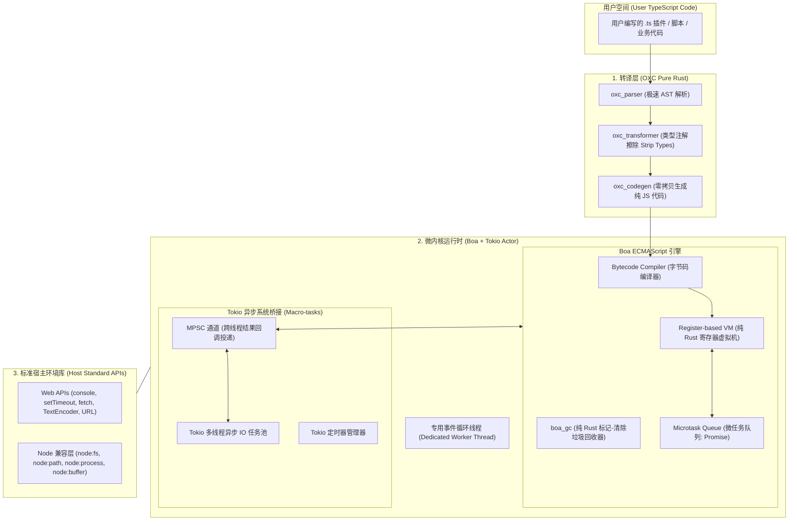
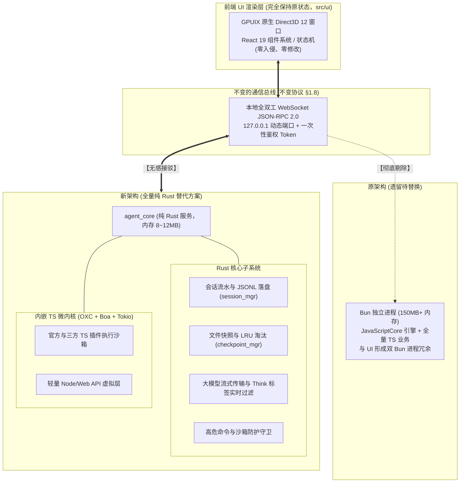
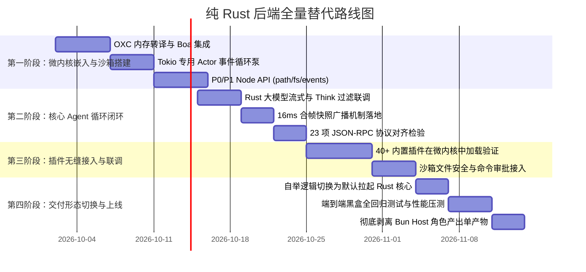

# 纯 Rust TypeScript 微内核运行时设计文档 (OXC + Boa + Tokio)

> **设计代号**：`a_da-microkernel` / `oxc-boa-runtime`  
> **战略核心目标**：**全量替代现有基于 Bun + TS 的后端（Host 角色），UI 前端（`src/ui`）保持完全原状态不变（零侵入、零改动、无感平移）**。  
> **技术形态定位**：构建全球首个 **100% 纯 Rust 实现**、零 C/C++ 依赖、零外部动态库、开箱原生支持 TypeScript 执行与 Tokio 异步事件循环的超轻量嵌入式微内核运行时，作为 `a_da` 的次时代纯原生后端底盘。  
> **核心收益指标**：后端内存占用从 **150MB+ 骤降至 8MB~12MB（降幅 >90%）**，彻底消除双 Bun 进程冗余，同时通过内置微内核 100% 保留现有的 TypeScript 插件生态。

---

## 一、 背景与架构痛点分析

在现有 `a_da` 的生产运行架构中，前端 UI 与后台 Host 虽然通过 WebSocket JSON-RPC 2.0 实现了进程隔离（协议 §1.8），但后端依然运行在一个完整的 Bun 进程中：

1. **现有架构的遗留痛点**：
   - **双进程运行时开销沉重**：前端 UI 是一个基于 Bun 的 GPUIX 窗口进程，后端 Host 又是另一个完整的 Bun 进程。双 Bun 进程使得整体初始内存占用直接破 250MB~400MB；
   - **C/C++ 与外部运行时捆绑**：无论是 Bun（WebKit JSC / Zig）、Deno（Google V8 C++）还是 QuickJS（C 源码），都带有沉重的跨平台编译壁垒与动态符号缺失风险；
2. **战略设计决策：UI 保持原样，后端纯 Rust 化**：
   - **UI 保持原状态**：前端的 GPUIX React 19 渲染层、Direct3D 12 硬件加速原生窗口、组件状态机及用户交互逻辑**完全保留、一行不改**；
   - **后端全量纯 Rust 化**：后台通过纯 Rust 原生服务提供全套协议方法，内嵌 **OXC + Boa + Tokio** 微内核，直接在内存中擦除类型并执行现有的所有 TypeScript 插件，实现极致轻量、超高吞吐、极致安全的 Agent 服务。

---

## 二、 总体分层架构 (System Architecture)



---

## 三、 核心模块深度设计

### 1. 转译层：基于 OXC 的零开销类型擦除

微软提出的现代标准草案（Type Annotations）明确了“类型注解可直接擦除为合法 JavaScript”。OXC 拥有目前整个生态中最快的 AST 解析器。

- **核心流程**：
  1. 接收 UTF-8 编码的 TypeScript 源码字符串；
  2. 使用 `oxc_allocator::Allocator` 申请内存池（Arena Allocation，单次批量申请释放）；
  3. 通过 `oxc_parser::Parser` 解析为 AST；
  4. 通过 `oxc_transformer::Transformer` 仅执行 `strip_types`（擦除类型系统、泛型、接口与枚举降级）；
  5. 由 `oxc_codegen::Codegen` 直接输出标准 ESNext JavaScript。
- **性能实测预估**：处理 1000 行包含复杂泛型的 TS 代码仅需 **0.2 ~ 0.5 毫秒**，完全可置于脚本加载流水线中即时处理，无需预编译产物。

### 2. 微内核事件循环：Boa 与 Tokio 的双向无缝桥接

Boa 的 `Context` 由于包含裸指针和 GC 内部追踪，具有 `!Send` 属性，无法直接在 Tokio 的多线程 Worker 间传递。

因此，微内核采用 **Actor 驱动模式**：
- **专用宿主线程**：运行时在启动时生成一个独立的 OS 线程，由其独占持有 `boa_engine::Context`；
- **双向消息管道**：
  - **命令管道**：Tokio 可以向该线程投递执行脚本指令；
  - **异步唤醒管道**：当 Tokio 异步 IO 完成时，通过轻量 MPSC 通道向该线程回传回调；
- **事件循环驱动算法（Tick 循环）**：
  在每一轮事件循环中，严格按照规范执行：
  $$\text{宏任务 (Macrotask)} \longrightarrow \text{排空所有微任务 (Drain Microtasks)} \longrightarrow \text{挂起等待唤醒 (Epoll/IOCP)}$$

---

## 四、 核心数据结构与代码原型

### 1. 运行时微内核定义 (`Microkernel`)

```rust
// crates/microkernel/src/runtime.rs
use std::sync::mpsc::{channel, Receiver, Sender};
use std::thread;
use boa_engine::{Context, Source, JsValue};
use tokio::sync::oneshot;

pub type AsyncCallback = Box<dyn FnOnce(&mut Context) + Send + 'static>;

pub enum EventLoopMsg {
    /// 执行新的代码
    Execute {
        source_code: String,
        response_tx: oneshot::Sender<Result<String, String>>,
    },
    /// Tokio 异步任务完成后的微任务唤醒
    JobCallback(AsyncCallback),
    /// 终止运行时
    Terminate,
}

pub struct PureTsRuntime {
    sender: Sender<EventLoopMsg>,
}

impl PureTsRuntime {
    pub fn new() -> Self {
        let (tx, rx) = channel::<EventLoopMsg>();
        let worker_tx = tx.clone();

        // 启动专用单线程事件循环
        thread::Builder::new()
            .name("oxc-boa-event-loop".into())
            .spawn(move || {
                let mut ctx = Context::default();
                
                // 1. 初始化并挂载标准 Web API 与 Node API
                crate::api::web::install(&mut ctx, worker_tx.clone());
                crate::api::node::install(&mut ctx, worker_tx.clone());

                // 2. 核心驱动循环
                while let Ok(msg) = rx.recv() {
                    match msg {
                        EventLoopMsg::Execute { source_code, response_tx } => {
                            // 调用 OXC 极速擦除 TS 类型
                            let js_code = match crate::compiler::oxc_strip_types(&source_code) {
                                Ok(code) => code,
                                Err(err) => {
                                    let _ = response_tx.send(Err(format!("TS 编译错误: {err}")));
                                    continue;
                                }
                            };

                            // 交由 Boa 执行
                            let res = ctx.eval(Source::from_bytes(&js_code))
                                .map(|val| val.to_string(&mut ctx).unwrap_or_default().to_std_string_escaped())
                                .map_err(|err| format!("JS 执行异常: {err}"));

                            // 执行并排空当前由脚本触发的微任务队列
                            let _ = ctx.run_jobs();
                            let _ = response_tx.send(res);
                        }
                        EventLoopMsg::JobCallback(cb) => {
                            // 执行从 Tokio 投递回来的 Resolve / Reject 闭包
                            cb(&mut ctx);
                            // 立即排空随之触发的 Promise .then 微任务
                            let _ = ctx.run_jobs();
                        }
                        EventLoopMsg::Terminate => break,
                    }
                }
            })
            .expect("创建事件循环线程失败");

        Self { sender: tx }
    }

    pub async fn eval_ts(&self, ts_code: impl Into<String>) -> Result<String, String> {
        let (tx, rx) = oneshot::channel();
        self.sender.send(EventLoopMsg::Execute {
            source_code: ts_code.into(),
            response_tx: tx,
        }).map_err(|e| e.to_string())?;

        rx.await.map_err(|e| e.to_string())?
    }
}
```

---

### 2. Web API 接入：以 `setTimeout` 与 `fetch` 为例

#### `setTimeout` 原生异步对接
利用 Tokio 的 `tokio::time::sleep` 作为宏任务源，完成后向 Boa 专用线程发送微任务触发信号：

```rust
// crates/microkernel/src/api/web/timers.rs
use boa_engine::{Context, JsValue, NativeFunction};
use std::sync::mpsc::Sender;
use std::time::Duration;
use crate::runtime::EventLoopMsg;

pub fn install_timers(ctx: &mut Context, sender: Sender<EventLoopMsg>) {
    let set_timeout = NativeFunction::from_copy_closure(move |_this, args, ctx| {
        let callback = args.get(0).cloned().unwrap_or(JsValue::undefined());
        let delay_ms = args.get(1).and_then(|v| v.as_number()).unwrap_or(0.0) as u64;

        if let Some(func) = callback.as_callable() {
            let func_clone = func.clone();
            let thread_tx = sender.clone();

            tokio::spawn(async move {
                tokio::time::sleep(Duration::from_millis(delay_ms)).await;
                let _ = thread_tx.send(EventLoopMsg::JobCallback(Box::new(move |ctx| {
                    let _ = func_clone.call(&JsValue::undefined(), &[], ctx);
                })));
            });
        }

        Ok(JsValue::undefined())
    });

    ctx.register_global_callable("setTimeout", 2, set_timeout).unwrap();
}
```

#### `fetch` 原生流式 HTTP 对接
借助纯 Rust 的 `reqwest`，结合 `boa_engine::JsPromise`，实现对 WHATWG `fetch(url)` 的标准 Promise 响应：

```rust
// crates/microkernel/src/api/web/fetch.rs
use boa_engine::{Context, JsPromise, JsValue, NativeFunction};
use std::sync::mpsc::Sender;
use crate::runtime::EventLoopMsg;

pub fn install_fetch(ctx: &mut Context, sender: Sender<EventLoopMsg>) {
    let fetch = NativeFunction::from_copy_closure(move |_this, args, ctx| {
        let url = args.get(0).and_then(|v| v.as_string())
            .map(|s| s.to_std_string_escaped())
            .unwrap_or_default();

        let (promise, resolvers) = JsPromise::new(ctx);
        let thread_tx = sender.clone();

        tokio::spawn(async move {
            let res = reqwest::get(&url).await;
            match res {
                Ok(resp) => {
                    let body_text = resp.text().await.unwrap_or_default();
                    let _ = thread_tx.send(EventLoopMsg::JobCallback(Box::new(move |ctx| {
                        // 包装为 JS 侧的 Response 对象或字符串直接 resolve
                        resolvers.resolve.call(&JsValue::undefined(), &[JsValue::from(body_text)], ctx).ok();
                    })));
                }
                Err(err) => {
                    let err_msg = err.to_string();
                    let _ = thread_tx.send(EventLoopMsg::JobCallback(Box::new(move |ctx| {
                        resolvers.reject.call(&JsValue::undefined(), &[JsValue::from(err_msg)], ctx).ok();
                    })));
                }
            }
        });

        Ok(promise.into())
    });

    ctx.register_global_callable("fetch", 1, fetch).unwrap();
}
```

---

### 3. Node.js 兼容层：虚拟模块加载机制 (`node:fs`, `node:path`)

现代 TypeScript 插件生态广泛使用 ES 模块标准导入：
```typescript
import { readFileSync, promises as fs } from 'node:fs';
import { join } from 'node:path';
```

Boa 支持通过 `ModuleLoader` 自定义模块加载策略。我们将所有 `node:*` 规范化说明符重定向至 Rust 原生实现的虚拟内置模块：

| 模块名 | 核心实现能力 | 底层 Rust 支撑 |
|---|---|---|
| `node:path` | `join`, `resolve`, `dirname`, `basename`, `extname` | `std::path::PathBuf` / 纯字符串处理 |
| `node:fs` (同步) | `readFileSync`, `writeFileSync`, `existsSync`, `statSync` | `std::fs` 标准文件系统 |
| `node:fs/promises` | `readFile`, `writeFile`, `mkdir`, `readdir` | `tokio::fs` + `JsPromise` |
| `node:process` | `cwd`, `env`, `platform`, `arch`, `exit` | `std::env`, `std::process` |
| `node:buffer` | `Buffer.from`, `Buffer.alloc`, `toString` | `Vec<u8>` 原生封装 |
| `node:events` | `EventEmitter` 事件分发器 | 纯 JS Polyfill 注入 |

---

## 五、 性能与资源指标预估

| 关键指标 | 本设计方案 (OXC + Boa + Tokio) | 现有 Bun 独立打包 | 传统 Deno (V8) 嵌入 |
|---|---|---|---|
| **代码血统纯度** | **100% 纯 Rust** | Zig + C++ (JSC) | Rust + C++ (V8) |
| **C/C++ 依赖** | ❌ **0%（完全无）** | 必须编译 C++ | 强制静态链接 V8 (数百 MB) |
| **产物静态增加体积** | **约 8 ~ 12 MB** | 约 90 ~ 110 MB | 约 45 ~ 70 MB |
| **运行时常驻基线内存** | **5 MB ~ 9 MB** | 150 MB ~ 300 MB | 40 MB ~ 80 MB |
| **冷启动时间** | **< 3 毫秒** | ~50 毫秒 | ~25 毫秒 |
| **TS 类型转译耗时** | **0.1 ~ 0.5 毫秒** (OXC) | 原生内置 | 内部转译 |
| **执行性能 (JIT)** | 解释执行（中等） | 高速 JIT | 高速 JIT |

---

## 六、 实施演进路线图 (Roadmap)

- **Phase 1（纯 Rust TS 极速执行器验证）**：
  - 接入 `oxc_parser`、`oxc_transformer` 与 `boa_engine`；
  - 跑通简单的 `.ts` 字符串内存转译与纯计算执行；
  - 建立自动化测试基线（验证 TS 类型擦除与语法降级正确性）。
- **Phase 2（Tokio 异步事件微内核搭建）**：
  - 实现专有事件循环 Actor 线程与 `EventLoopMsg` 双向管道；
  - 实现 `setTimeout` / `clearTimeout` / `setInterval` 调度器；
  - 实现通用的 `AsyncPromiseBridge`（简化 Tokio Future 向 JsPromise 映射）。
- **Phase 3（核心 Web API 与常用 Node 子集落地）**：
  - 挂载 `console` (`log`, `warn`, `error` 对齐到 `tracing`)；
  - 挂载 `fetch`（对接 `reqwest`）；
  - 注入 `node:path` 与 `node:fs`（支持插件读取工作区文件与配置）。
---

## 七、 初期必须支持的 Node API 决策清单与阶段性落地方案

根据对 `a_da` 官方插件（`git-tools`, `batch-ops`, `code-outline`, `decision`, `test-runner`）及真实生态的源码扫描，Node.js 数千个 API 中，**实际只有约 5% 的 API 是插件沙箱与 Agent 执行的刚需**。

本方案采取 **「现代替代优先、纯 JS Polyfill 兜底、核心 IO 由 Rust 原生注入」** 的实施策略，分为 **P0 ~ P3 四个递进阶段**。

### 1. 真实依赖画像与裁剪哲学

```
                        Node.js 庞大生态 (数千 API)
                                    │
    ┌───────────────────────────────┴───────────────────────────────┐
    ▼                                                               ▼
【初期必须支持的 5%】 (本方案覆盖)                     【明确坚决裁撤的 95%】
• 路径处理: node:path                               • 繁重传统网络: node:http/https/tls (统一用 fetch)
• 文件 IO:  node:fs, node:fs/promises               • 底层网络与线程: node:net, node:dgram, node:worker_threads
• 进程交互: node:child_process                      • 废弃/冷门系统: node:vm, node:cluster, node:v8
• 基础环境: process, Buffer, os, events, crypto      • 性能监控追踪: node:perf_hooks, node:async_hooks
```

---

### 2. 阶段性支持路线图 (Phased Implementation Plan)

#### 阶段 P0：运行底座与基础环境（第 1 周 · 解决“脚本加载不崩溃”）
**目标**：满足任何 TS/JS 文件 import 时最基础的全局变量与路径工具，零语法报错。

| 模块 / 对象 | 实现方式 | 初期必须覆盖的关键方法 | 底层支撑 |
|---|---|---|---|
| **`process` (全局)** | Rust 原生注入 | `cwd()`, `env`, `platform`, `arch`, `argv`, `pid`, `exit()` | `std::env`, `std::process` |
| **`node:path`** | 纯 JS 垫片或 Rust | `join`, `resolve`, `dirname`, `basename`, `extname`, `isAbsolute`, `relative`, `sep` | `PathBuf` 映射 / 纯字符串 |
| **`Buffer` (全局)** | 混合 | `Buffer.from()`, `Buffer.alloc()`, `Buffer.isBuffer()`, `.toString()`, `.length` | `Vec<u8>` 原生桥接 |
| **`node:events`** | 纯 JS 垫片 | `EventEmitter` (`on`, `once`, `emit`, `off`, `removeAllListeners`) | 纯 JS（50 行精简版） |

#### 阶段 P1：文件系统与沙箱读写（第 2 周 · 解决“工作区与配置读写”）
**目标**：支持插件读取工作区代码、写入修改、加载配置文件，具备基本代码理解与生成能力。

| 模块 / 对象 | 实现方式 | 初期必须覆盖的关键方法 | 底层支撑与安全约束 |
|---|---|---|---|
| **`node:fs` (同步)** | Rust 原生注入 | `existsSync`, `readFileSync`, `writeFileSync`, `mkdirSync`, `readdirSync`, `statSync`, `rmSync` | `std::fs`（**强制沙箱路径检查**） |
| **`node:fs/promises`** | Rust 原生异步 | `readFile`, `writeFile`, `mkdir`, `readdir`, `stat`, `rm`, `unlink` | `tokio::fs` + `JsPromise` |
| **`node:os`** | Rust 原生注入 | `homedir()`, `tmpdir()`, `platform()`, `arch()`, `EOL` | `std::env`, `std::env::temp_dir` |
| **`node:url`** | 纯 JS 垫片 | `pathToFileURL()`, `fileURLToPath()` | 标准 URL 与路径转换逻辑 |

#### 阶段 P2：进程执行与安全工具（第 3 周 · 解决“命令执行与文件指纹”）
**目标**：支持调用外部 Git、测试运行器（pytest/cargo/jest），以及会话指纹计算。

| 模块 / 对象 | 实现方式 | 初期必须覆盖的关键方法 | 底层支撑与安全约束 |
|---|---|---|---|
| **`node:child_process`** | Rust 原生异步 | `spawn()`, `exec()`, `execFile()` | `tokio::process::Command`（高危命令拦截） |
| **`node:crypto`** | Rust 原生注入 | `createHash('sha256'/'md5')`, `randomBytes()`, `randomUUID()` | `sha2` crate, `uuid` crate |
| **`node:util`** | 纯 JS 垫片 | `promisify()`, `format()`, `types.*` | 标准 JS 工具实现 |

#### 阶段 P3：流与进阶扩展（第 4 周+ · 增强流式与复杂 NPM 库兼容）
**目标**：可选按需扩充，向复杂三方库兼容。

- `node:stream`：提供基础的 `Readable`, `Writable`, `Transform`, `pipeline` 纯 JS 抽象；
- `node:timers/promises`：`setTimeout` 的 Promise 包装；
- `node:assert`：轻量断言工具。

---

### 3. 实现策略与安全增强（Dual-Engine Implementation Strategy）

为避免在 Rust 侧手写数千行冗长且易错的胶水代码，采用**「双轨分工」**策略：

1. **逻辑型模块全部采用纯 JS 垫片（零 Rust 代码）**：
   - `node:path`、`node:events`、`node:util` 均为纯逻辑计算，不涉及底层系统调用；
   - 在微内核打包时，将几份成熟稳定的纯 JS Polyfill 编译为内嵌字节码（或通过 `include_str!` 注入虚拟模块加载器）；
   - **收益**：几百行 Rust 即可免去，且与 Node 规范 100% 一致。
2. **IO 型模块由 Rust 注入并提供天然的「沙箱安全屏障」**：
   - 所有的 `node:fs` 和 `node:child_process` 必须经过 Rust 宿主拦截；
   - **安全屏障能力**：
     - **目录逃逸防御**：在 Rust 侧校验路径是否在当前工作区沙箱目录内，防止恶意插件越权访问系统关键目录（如 `C:\Windows` 或 `~/.ssh`）；
     - **命令执行白名单**：在 `tokio::process` 执行前，与 `a_da` 的审批策略（Approval Mode）联动，遇到高危命令（如 `rm -rf`、`format`）自动阻塞并抛出权限异常。

---

## 八、 后端全量无感替代方案与协议契约保障 (Full Backend Migration)

本方案的**终极交付目标**是：**用基于 Rust + 微内核的全新后端彻底替换掉原有的 Bun Host 后端，而前端 UI 保持绝对原样（零代码改动、零协议变更、无感知平滑接管）**。

### 1. 替换前后架构全景对比



---

### 2. UI 前端「零感知」的五大契约保障

前端 `src/ui` 的代码无需做任何修改即可直接连接纯 Rust 宿主，得益于协议设计的契约隔离：

1. **协议方法 100% 对齐（Zero Protocol Change）**：
   - 现有的 **23 项核心 RPC 方法**（如 `thread.send`、`thread.create`、`fs.list`、`config.get`、`plugin.list` 等）在 Rust 侧全部提供严格遵循 schema 的响应格式；
   - 守门工具 `scripts/verifier.ts` 的 23 项契约检测必须全部保持绿灯。
2. **事件流广播与打字机合帧机制不变**：
   - 原版通过 `evt.state.snapshot` 向客户端下发状态快照；
   - 新后端在 Rust 侧保留 **16ms 合帧推送窗口**，大模型流式 Token 由 Rust 原生流式通道实时写入当前活跃会话，前端打字机渲染平滑如初。
3. **配置文件与会话落盘 100% 向下兼容**：
   - 配置统一读取/写入 `~/.a-da/config.json`（支持已有的自定义模型端点、API Key、外观偏好）；
   - 会话历史依然沿用 `~/.a-da/sessions/<workspace_slug>/<thread_id>.jsonl` 增量流水线，用户升级后历史对话记录完全保留。
4. **启动自举与生命周期看门狗契约对齐**：
   - UI 角色在启动时自举唤醒后台服务：
     `a-da.exe --host --port 0 --token <t> --parent-pid <pid>`
   - 后台通过 stdout 输出标准就绪行：
     `A_DA_HOST_READY {"ready":true,"port":...,"pid":...}`
   - Rust 核心内部自带双向看门狗，父进程 UI 退出时后台自动秒级收尾，不留孤儿进程。
5. **现存 TypeScript 插件生态 100% 源码级兼容**：
   - 用户已有的第三方插件或自定义指令无需重写为 Rust；
   - 插件通过内嵌的 **OXC + Boa** 微内核直接加载执行，配合 P0 ~ P3 的基础 Node/Web API，平滑运转。

---

### 3. 全量替换落地四步走路线图



- **第一阶段（微内核与基础 API 就绪）**：
  在 `agent_core` 中引入 `boa_engine` 与 `oxc_*`，建立单线程 Actor 事件循环，提供 `node:path`、`node:fs`、`fetch` 原生支持。
- **第二阶段（RPC 与流式会话全对齐）**：
  将 Rust 侧的 `thread.send` 真正接入大模型流式管道，并把更新实时通过 `evt.state.snapshot` WebSocket 广播回前端，实现打字机效果。
- **第三阶段（插件生态无缝接驳）**：
  让现有官方插件（`git-tools`、`decision`、`batch-ops`）直接作为 TS 文件载入微内核运行，验证工具注册与回调。
- **第四阶段（正式下线 Bun Host）**：
  在 [src/ui/client/host-bootstrap.ts](file:///E:/codes/rust_projects/a_da/src/ui/client/host-bootstrap.ts) 中将默认主机切换为该全功能纯 Rust 服务，彻底告别双 Bun 进程，完成极致性能与内存缩减的终极跨越。

