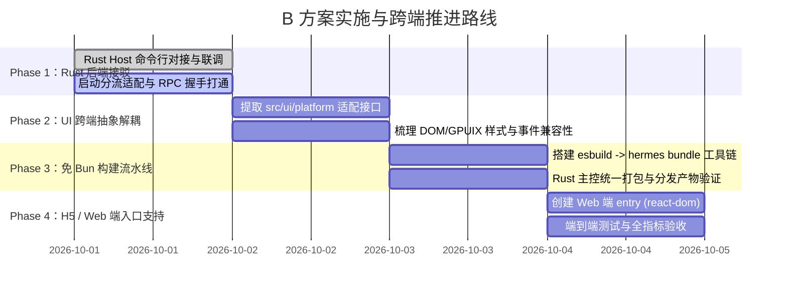

# B 方案：React UI 跨端抽象（GPUIX 桌面 + H5 端）与轻量免 Bun 联合编译设计

## 1. 架构目标与设计理念

当前项目的核心优化目标是在**彻底解决内存过高**的同时，**最大化复用现有 60 个高质量 UI 组件（约 800KB 代码）**，并为未来**一键发布为 H5 / Web 端**奠定基础。

```
                  ┌───────────────────────────────────────────────┐
                  │      React 19 跨端业务组件树 (src/ui/)         │
                  │   Composer / Transcript / Sidebar / Store     │
                  └───────────────────────┬───────────────────────┘
                                          │
            ┌─────────────────────────────┴─────────────────────────────┐
            ▼                                                           ▼
┌──────────────────────────────┐                            ┌──────────────────────────────┐
│  目标一：本地原生桌面端 (Desktop) │                            │      目标二：浏览器与 H5 端    │
├──────────────────────────────┤                            ├──────────────────────────────┤
│ • 渲染器：@gpuix/react        │                            │ • 渲染器：react-dom / Web    │
│ • 宿主：Hermes / 轻量引擎     │                            │ • 容器：标准浏览器 / 移动端 PWA│
│ • 窗口：Zed gpui 硬件 GPU 加速 │                            │ • 通信：远程 WebSocket / WSS │
│ • 进程：双角色架构 (UI ↔ Host) │                            │ • 部署：连接远程/本机 agent_core│
│ • 内存：~35MB (极致轻量)       │                            │ • 内存：取决于移动端/浏览器内核 │
└──────────────┬───────────────┘                            └──────────────┬───────────────┘
               │                                                           │
               └───────────────────────────┬───────────────────────────────┘
                                           │ JSON-RPC 2.0 (全双工协议)
                                           ▼
                       ┌───────────────────────────────────────┐
                       │     纯 Rust 原生后端 (agent_core)     │
                       │ • Session / Checkpoint / Tools 沙箱   │
                       │ • AI 流式决策循环 / ThinkTagFilter   │
                       │ • 内存底噪 ~15MB，冷启动 <30ms        │
                       └───────────────────────────────────────┘
```

### 核心收益
1. **代码零重写**：既有的 `Transcript.tsx`、`Composer.tsx`、`Sidebar.tsx`、`ChangesPanel.tsx` 等全量组件无需推翻，100% 保持 React 生态的高敏捷迭代。
2. **天然支持 H5 / Web 端**：组件与底层渲染驱动解耦，只需接入标准 `react-dom`，即可在移动端、平板或浏览器直接访问。
3. **脱离 Bun 打包限制**：彻底摒弃原先 `bun build --compile` 将整个 Bun 宿主打包导致的巨大体积和 150MB+ 内存底噪，改用轻量预编译字节码宿主。
4. **统一双角色管理**：外层通过 Rust 二进制统一启动与分流，严格维持“主机角色（Host）”与“界面角色（UI）”的崩溃隔离（Crash Isolation）。

---

## 2. 跨端 UI 抽象与分层设计

为了让同一份 React 代码同时跑在 GPUIX 原生窗口与 Web H5 页面中，需要将 **平台渲染驱动** 与 **传输通道** 抽象为适配层：

### 2.1 渲染平台适配层 (`src/ui/platform/`)

```typescript
// src/ui/platform/index.ts
export interface UIPlatformAdapter {
  /** 挂载根节点 */
  mount(app: React.ReactNode, options: WindowOptions): void
  /** 获取系统主题外观与缩放比 */
  getAppearance(): { theme: 'dark' | 'light'; scale: number }
  /** 原生窗口控制（最小化/最大化/关闭，H5 端自动转为无操作） */
  windowControl(action: 'minimize' | 'maximize' | 'close'): void
  /** 打开系统文件选择器 */
  pickFile(options: FilePickerOptions): Promise<string[] | null>
}
```

- **GPUIX 桌面实现**：封装 `@gpuix/react` 的 `render()`，调用 `gpuix-native` 与 Win32 原生窗口 API。
- **Web / H5 实现**：封装 `react-dom/client` 的 `createRoot()`，调用标准 DOM 事件与 HTML5 `<input type="file">`。

### 2.2 RPC 通信通道抽象 (`src/ui/client/transport.ts`)

当前 `src/ui/client/` 已经天然具备了极高的跨端适应性：
- 桌面端：连接 `ws://127.0.0.1:{port}`（由本地后台派生的 `a-da.exe --host` 提供）。
- H5 端：连接用户配置的或当前域名同源的 `wss://api.example.com`（远程部署的 `agent_core` 服务）。
- 协议层：均采用标准的 JSON-RPC 2.0，所有接口（`thread.send`、`workspace.getSnapshot`、`change.apply`）两端 100% 一致。

---

## 3. 桌面端“免 Bun 打包”实现方案

GPUIX 在 [`gpuix/hermes`](file:///E:/codes/rust_projects/gpuix/hermes) 中已经验证了“React ➔ Hermes 字节码 ➔ GPUI 原生窗口”的完整流水线：

### 3.1 构建流程（Build Pipeline）
1. **ESBuild 生产打包**：
   将 `src/ui/main.tsx` 及其依赖的 60 个组件打包为精简的单个 CommonJS 文件 `dist/ui.cjs`。
   - 提取外部原生插件声明（`external: ['@gpuix/native']`）。
   - 注入微任务垫片（`queueMicrotask` 与 `performance.now`）。
2. **生成 Hermes 静态字节码（Hermes Bytecode）**：
   使用 Hermes 编译器将 `dist/ui.cjs` 编译为预解析字节码 `dist/ui.bundle`（体积通常仅 200KB~400KB）。
   - **零 JIT 膨胀**：字节码直接由 Hermes 虚拟机按需解释执行，没有传统 JS 引擎在运行时进行 Baseline/TurboFan 编译带来的数十兆内存开销。
3. **单二进制打包（Single Executable）**：
   - 将 Hermes 运行时与 `@gpuix/native`（Rust）动态或静态链接进 Rust 主启动器。

---

## 4. 单二进制双角色（Single Binary, Dual Role）在 Rust 主控下的实现

为保持与当前规范严格一致的单文件分发，整个应用的统一入口由 Rust 编写：

```rust
// src/main.rs (或 a-da 统合入口)
fn main() -> anyhow::Result<()> {
    let args: Vec<String> = std::env::args().collect();
    
    // 检查是否为主机角色
    if args.iter().any(|arg| arg == "--host") {
        // ========== 角色一：无头 Agent 核心 ==========
        // 彻底切断任何图形/窗口依赖，纯 Tokio 异步运行时
        return agent_core::server::run_host_from_cli(args);
    }
    
    // ========== 角色二：GPUIX 桌面界面角色 ==========
    // 1. 自动在后台 spawn 自身作为子进程：Command::new(current_exe).arg("--host")...
    // 2. 启动轻量 Hermes 宿主，加载预置字节码 UI
    // 3. 驱动 GPUI 窗口渲染并连接子进程 RPC
    run_desktop_ui(&args)
}
```

### 为什么必须坚决保持双进程隔离？
1. **显卡与图形崩溃不影响 Agent 执行**：
   如果用户电脑锁屏、GPU 驱动重置或意外关闭窗口，UI 进程即便退出，后端的 AI 循环、文件修改、快照保护依然稳妥在后台运行。
2. **资源调度隔离**：
   复杂的代码分析、大量文件索引和命令执行在独立进程内调度，绝不会阻塞 UI 帧率（保持稳定的 60FPS/120FPS 流畅交互）。

---

## 5. 实施路线图（Implementation Roadmap）



### 当前立即落地的关键动作：
1. **将原生 `agent_core` 二进制打通为 `--host` 的第一后端执行源**。
2. **在主仓库新增 `src/ui/platform/` 平台适配器**，对现有 UI 组件实现无缝包装，隔离特定平台的原生调用。
3. **编写统一构建脚本**，实现免 Bun 依赖的 UI CJS bundle 打包。
